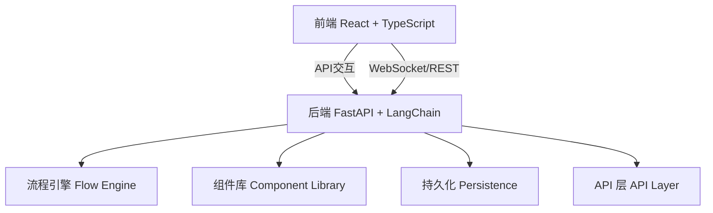

## 联系作者

码云: https://gitee.com/daimaxiuligong/langflow

github: https://github.com/daimaxiuligong/langflow


支持定制

## 一、项目简介

Langflow 是一款基于 [LangChain](https://github.com/langchain-ai/langchain) 的可视化 LLM 流程编排平台。它允许用户通过拖拽和配置的方式，将大语言模型（LLM）、数据源、工具等组件灵活组合，快速搭建、测试和部署 AI 应用。Langflow 适合开发者和非技术用户，极大降低了 AI 应用开发门槛，支持多种主流 LLM、丰富的内置组件和工具链，并具备流程保存、导出与复用等能力。

**核心优势：**

- 无代码/低代码，极易上手
- 支持多种主流 LLM（如 OpenAI、LLama、ChatGLM 等）
- 丰富的内置组件和工具链
- 可视化流程编排与调试
- 支持流程保存、导出与复用
- 易于扩展，适配多样化业务场景

------

## 二、项目架构与核心模块

Langflow 采用前后端分离架构，便于扩展和维护。

### 2.1 架构总览



- **前端**：基于 React + TypeScript，实现流程图可视化、节点拖拽、参数配置等交互。
- **后端**：基于 FastAPI（Python），负责流程解析、模型调用、数据处理和 API 服务。

### 2.2 核心模块

- **流程引擎（Flow Engine）**：解析和执行用户搭建的 LLM 流程，支持条件分支、循环等复杂逻辑。
- **组件库（Component Library）**：内置多种 LLM、工具、数据处理节点，支持自定义扩展。
- **持久化（Persistence）**：支持流程的保存、加载与导出，便于团队协作和流程复用。
- **API 层（API Layer）**：RESTful API，支持前端交互和第三方系统集成。
- **权限与用户管理**（可选）：支持多用户和权限控制，保障数据安全。

------

## 三、技术详解

### 3.1 前端技术详解

- **React + TypeScript**：实现响应式 UI 和类型安全，提升开发效率和代码可维护性。
- **react-flow-renderer**：用于流程图的节点拖拽、连线和布局，极大提升了可视化体验。
- **状态管理**：通常使用 React Context 或 Redux 管理全局状态，保证流程数据一致性。
- **API 通信**：通过 axios 与后端 RESTful API 交互，动态加载组件、保存/加载流程等。
- **可扩展性**：支持自定义节点和参数配置，便于扩展新功能和适配不同业务场景。
- **用户体验**：支持流程的保存、导入导出、实时调试和结果可视化。

### 3.2 后端技术详解

- **FastAPI**：高性能异步 Web 框架，负责 API 服务和流程执行，支持自动生成 API 文档。
- **LangChain 集成**：通过 LangChain 调用多种 LLM（如 OpenAI、LLama、ChatGLM 等），并支持工具链扩展。
- **流程引擎**：解析前端传来的流程定义（JSON），动态构建和执行 LLM 流程，支持条件分支、循环等复杂逻辑。
- **异步处理**：利用 Python 的 async/await 提高并发能力，适合高并发场景。
- **安全与权限**：可集成 OAuth2/JWT 实现用户认证与权限控制，保障数据安全。
- **持久化**：流程数据可存储于本地文件、数据库或云端，支持团队协作和流程复用。
- **日志与监控**：集成日志系统，便于流程追踪和问题定位。

### 3.3 典型流程解析

1. 用户在前端拖拽节点，配置参数，形成流程图。
2. 前端将流程定义（JSON）发送到后端。
3. 后端解析流程，调用相应 LLM 和工具节点，执行流程。
4. 执行结果返回前端，前端展示结果或可视化流程状态。


------


## 四、安装部署

### 方法一、pip安装

```
# 安装uv，直接在官网下载对应版本https://github.com/astral-sh/uv/releases

mkdir langflow # 创建项目文件夹uvtest
cd langflow # 进入项目文件夹
# 创建虚拟环境
uv venv .venv
# 或创建指定版本的python虚拟环境
uv venv --python C:\soft\python12 .venv

# 激活虚拟环境
# Linux/macOS
source .venv/bin/activate
# Windows
.venv\Scripts\activate


# 安装langflow
uv pip install langflow -U
# 运行
langflow run
或
uv run langflow run

# 访问
http://127.0.0.1:7860

# 可以修改环境变量改变ip和端口
set LANGFLOW_HOST=0.0.0.0
set LANGFLOW_PORT=7860

# 设置日志等级
set LANGFLOW_LOG_LEVEL=WARNING
```

常见问题

```
问题1：webrtcvad安装失败
现象：
 Failed to build `webrtcvad==2.0.10`
  |-> The build backend returned an error
  `-> Call to `setuptools.build_meta:__legacy__.build_wheel` failed (exit code: 1)
   C:\soft\python3.13.2\include\pyconfig.h(59): fatal error C1083: io.h: No such file or directory
解决：
从 Microsoft 官网https://developer.microsoft.com/en-us/windows/downloads/windows-sdk/ 下载安装windows sdk

问题2： 缺少gcc
现象：
  x Failed to build `numpy==1.26.4`
  |-> The build backend returned an error
  `-> Call to `mesonpy.build_wheel` failed (exit code: 1)
		。。。
      C compiler for the host machine: gcc (gcc 8.1.0 "gcc (x86_64-win32-sjlj-rev0, Built by MinGW-W64 project)
      8.1.0")
      C linker for the host machine: gcc ld.bfd 2.30
      C++ compiler for the host machine: c++ (gcc 8.1.0 "c++ (x86_64-win32-sjlj-rev0, Built by MinGW-W64 project)
      8.1.0")

umPy 在 Windows 上依赖 MSVC 编译工具链，MinGW 可能不兼容，我把mingw从环境变量溢出即可。
```


### 方法二、docker 安装部署

```
docker run -d -p 7860:7860 langflowai/langflow:latest
或指定版本号
docker run -d -p 7860:7860 langflowai/langflow:1.4.3
```


### 方法三、源码安装与部署

1. **克隆项目**

   ```bash
   git clone https://github.com/langflow-ai/langflow.git
   cd langflow
   ```

2. **激活虚拟环境**

   ```bash
   # 安装uv，直接在官网下载对应版本https://github.com/astral-sh/uv/releases
   # 这一步不用，因为pull下拉的代码仓库里面包含了虚拟环境
   uv venv .venv
   
   # Linux/macOS
   source .venv/bin/activate
   # Windows
   .venv\Scripts\activate
   ```

   ```
   官网虚拟环境中可能缺少部分库，按需求手动安装
   uv pip install scipy -i https://pypi.tuna.tsinghua.edu.cn/simple
   ```

   

3. **安装前端依赖**

   ```bash
   cd frontend
   npm install
   ```

4. **启动服务**

   - 启动后端：

     ```bash
     uv run uvicorn langflow.main:create_app --host 0.0.0.0 --port 7860 --loop asyncio --reload 
     ```

     ```
     uv run:此处通过 uv run 启动一个基于 uvloop 的子进程，再由该子进程运行 Uvicorn 服务器
     uvicorn：一个轻量级、快速的 ASGI 服务器/工具包，用于运行 Python Web 应用（如 FastAPI、Starlette）
     --loop asyncio：强制使用 Python 标准库的 asyncio 事件循环
     --reload：启用代码热重载，开发模式专用，监控代码文件变化并自动重启服务器。
     ```

     

   - 启动前端：

     ```bash
     cd frontend
     npm start
     ```

   - 访问`http://127.0.0.1:3000`使用可视化界面。


