# Agent(智能体)

Agent 组件定义了 AI 智能体在流程中的行为和能力。智能体使用 LLM 作为推理引擎，决定使用哪些连接的工具组件来解决问题。

Agent 函数中的工具本质上是Agent 可以调用来执行任务或访问外部资源的函数。函数被包装为具有agent可以理解的公共接口的`Tool`对象。Agent 通过工具注册了解工具，其中Agent 通常在Agent 初始化时获得可用工具的列表。`Tool`对象的描述告诉Agent 工具可以做什么。

然后，Agent 使用连接的LLM来推理问题，以决定哪种工具最适合这项工作。

## 在流程中使用 Agent

简单 Agent入门项目使用连接了 URL 和计算器工具的 Agent 组件来回答用户问题。OpenAI LLM 充当Agent的"大脑"来决定使用哪个工具。工具通过 **Tools 端口**连接到 Agent 组件。

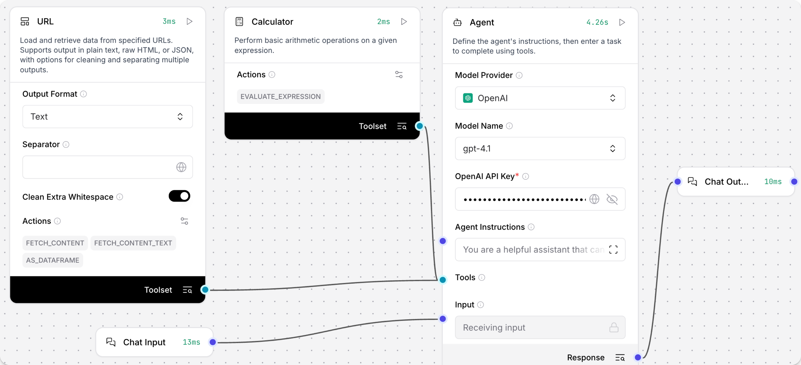

**Agent启动流程（图示意：Agent -> Tools 端口 -> 工具）**


## Agent 组件
该组件创建可以回答问题并基于给定指令执行任务的agent。

### 参数说明
输入参数

| 参数名                | Type     | Description（中文翻译）                                      |
| --------------------- | -------- | ------------------------------------------------------------ |
| agent_llm             | Dropdown | 代理用于生成响应的语言模型提供商。选项包括 OpenAI 和其他提供商或自定义。 |
| system_prompt         | String   | 系统提示提供初始指令和上下文，以引导代理的行为。             |
| tools                 | List     | 代理可用的工具列表。此字段为可选，可以留空。                 |
| input_value           | String   | 代理需要处理的任务或问题输入。                               |
| add_current_date_tool | Boolean  | 当设置为 `true` 时，会为代理添加一个返回当前日期的工具。     |
| memory                | Memory   | 可选的内存配置，用于维护对话历史。                           |
| max_iterations        | Integer  | 代理可以执行的最大迭代次数。                                 |
| handle_parsing_errors | Boolean  | 此参数决定是否在代理执行过程中处理解析错误。                 |
| verbose               | Boolean  | 启用此参数可输出详细日志，用于调试和详细记录。               |

输出参数

| 参数名     | 类型    | 描述                   |
| ---------- | ------- | ---------------------- |
| `response` | Message | Agent 对给定输入的响应 |

# Data(数据组件)

数据组件用于将数据从各种来源加载到你的流程（flow）中。

它们可以执行一些处理或类型检查，比如将原始 HTML 数据转换为文本，或确保加载的文件类型符合要求。


## API 请求组件

该组件可通过 URL 或 cURL 命令发起 HTTP 请求。

- 在流程中使用时，将 Data 输出连接到可接受输入的组件。例如，连接到 Chat Output 组件。
- 在 API 组件的 URLs 字段输入请求的端点。例如：https://dummy-json.mock.beeceptor.com/posts
- 在 Method 字段输入请求类型（如 GET、POST、PATCH、PUT、DELETE）。
- 可选：启用 Use cURL 按钮，粘贴 curl 命令自动填充请求参数。
- 点击 Playground，然后点击 Run Flow，结果会显示在 result 字段。

参数

**输入**

| 名称                   | 显示名称               | 说明                                     |
| ---------------------- | ---------------------- | ---------------------------------------- |
| urls                   | URLs                   | 输入一个或多个 URL，用逗号分隔。         |
| curl                   | cURL                   | 粘贴 curl 命令自动填充 headers 和 body。 |
| method                 | Method                 | HTTP 请求方法。                          |
| use_curl               | Use cURL               | 启用 cURL 模式。                         |
| query_params           | Query Parameters       | URL 查询参数。                           |
| body                   | Body                   | 请求体（POST、PATCH、PUT 时使用）。      |
| headers                | Headers                | 请求头。                                 |
| timeout                | Timeout                | 请求超时时间。                           |
| follow_redirects       | Follow Redirects       | 是否跟随重定向。                         |
| save_to_file           | Save to File           | 是否将响应保存为临时文件。               |
| include_httpx_metadata | Include HTTPx Metadata | 是否包含 headers、status_code 等元数据。 |

**输出**

| 名称      | 显示名称  | 说明                              |
| --------- | --------- | --------------------------------- |
| data      | Data      | API 请求结果，包含源 URL 和结果。 |
| dataframe | DataFrame | 将 API 响应数据转换为表格格式。   |

## 目录（Directory）组件

递归加载目录下的文件，可指定文件类型、深度和并发数。

参数

**输入**

| 输入名             | 类型             | 说明                         |
| ------------------ | ---------------- | ---------------------------- |
| path               | MessageTextInput | 目录路径                     |
| types              | MessageTextInput | 加载的文件类型（留空为全部） |
| depth              | IntInput         | 搜索深度                     |
| max_concurrency    | IntInput         | 最大并发数                   |
| load_hidden        | BoolInput        | 是否加载隐藏文件             |
| recursive          | BoolInput        | 是否递归搜索                 |
| silent_errors      | BoolInput        | 是否静默处理错误             |
| use_multithreading | BoolInput        | 是否使用多线程               |

**输出**

| 输出名    | 类型       | 说明               |
| --------- | ---------- | ------------------ |
| data      | List[Data] | 加载的文件数据     |
| dataframe | DataFrame  | 表格格式的文件数据 |

## 文件（File）组件

加载并解析各种格式的文件，将内容转换为 Data 对象。支持多种文件类型，并提供并发处理和错误处理选项。

**使用方法：**

1. 点击“选择文件”按钮。
2. 选择本地文件或已加载的文件，点击“选择文件”。
3. 加载的文件名会显示在组件中。

默认最大支持文件大小为 100 MB，可通过 --max-file-size-upload 修改。

参数

**输入**

| 名称                                | 显示名称                            | 说明                                    |
| ----------------------------------- | ----------------------------------- | --------------------------------------- |
| path                                | Files                               | 文件路径，支持单个或归档文件            |
| file_path                           | Server File Path                    | 指向服务器文件的 Data 或 Message 对象   |
| separator                           | Separator                           | 多输出时的分隔符                        |
| silent_errors                       | Silent Errors                       | 是否静默处理错误                        |
| delete_server_file_after_processing | Delete Server File After Processing | 处理后是否删除服务器文件                |
| ignore_unsupported_extensions       | Ignore Unsupported Extensions       | 忽略不支持的扩展名                      |
| ignore_unspecified_files            | Ignore Unspecified Files            | 忽略无 file_path 属性的 Data            |
| use_multithreading                  | [已弃用] Use Multithreading         | 并发处理，建议用 Processing Concurrency |
| concurrency_multithreading          | Processing Concurrency              | 并发处理文件数，默认 1                  |

**输出**

| 名称      | 显示名称  | 说明                      |
| --------- | --------- | ------------------------- |
| data      | Data      | 文件内容的 Data 对象      |
| dataframe | DataFrame | 文件内容的 DataFrame 对象 |
| message   | Message   | 文件内容的 Message 对象   |

**支持文件类型：**

- 文本类：.txt, .md, .csv, .json, .yaml, .xml, .html, .pdf, .docx, .py, .sh, .sql, .js, .ts, .tsx
- 压缩包：.zip, .tar, .tgz, .bz2, .gz

## SQL 查询组件

在指定数据库上执行 SQL 查询。

参数

**输入**

| 名称            | 显示名称        | 说明                             |
| --------------- | --------------- | -------------------------------- |
| query           | Query           | 要执行的 SQL 查询                |
| database_url    | Database URL    | 数据库连接 URL                   |
| include_columns | Include Columns | 是否包含列信息                   |
| passthrough     | Passthrough     | 出错时返回查询语句而不是抛出异常 |
| add_error       | Add Error       | 是否将错误添加到结果             |

**输出**

| 名称   | 显示名称 | 说明         |
| ------ | -------- | ------------ |
| result | Result   | SQL 查询结果 |

## URL 组件

抓取一个或多个 URL 的内容，处理后以多种格式返回。支持输出纯文本或原始 HTML。

- 在 URLs 字段输入要抓取的 URL，点击“+”可添加多个。
- 可设置 Max Depth 控制爬取深度（如 1 只抓取本页，2 抓取本页及所有链接页）。
- 可选择输出格式（Text 或 HTML）。
- 可连接 Regex Extractor 组件提取内容。

**示例：**  
用正则提取维基百科首页新闻段落：

正则表达式：
```
In the news\s*\n(.*?)(?=\n\n)
```
结果示例：
```
秘鲁作家、诺贝尔文学奖得主马里奥·巴尔加斯·略萨（如图）逝世，享年89岁。
```

参数

**输入**

| 名称            | 显示名称        | 说明                     |
| --------------- | --------------- | ------------------------ |
| urls            | URLs            | 输入一个或多个 URL       |
| max_depth       | Max Depth       | 爬取深度                 |
| prevent_outside | Prevent Outside | 仅爬取同域名下的页面     |
| use_async       | Use Async       | 是否异步加载             |
| format          | Output Format   | 输出格式（Text 或 HTML） |
| timeout         | Timeout         | 请求超时时间             |
| headers         | Headers         | 请求头                   |

**输出**

| 名称      | 显示名称  | 说明                         |
| --------- | --------- | ---------------------------- |
| data      | Data      | 包含内容和元数据的 Data 列表 |
| text      | Message   | 格式化文本内容               |
| dataframe | DataFrame | 表格格式内容                 |

## Webhook 组件

定义一个 webhook 触发器，收到 HTTP POST 请求时运行流程。

- 输入不是有效 JSON 时，会自动包装为 payload 对象。
- 添加 Webhook 组件后，API 面板会出现 Webhook cURL 标签，提供触发示例。

**测试方法：**

1. 添加 Webhook 组件到流程。
2. 连接 Webhook 的 Data 输出到 Parser 组件的 Data 输入。
3. Parser 的 Parsed Text 输出连接到 Chat Output 的 Text 输入。
4. 在 Parser 组件选择 Stringify 模式。
5. 复制 Webhook cURL 标签的代码，在终端发送 POST 请求。
6. 打开 Playground，查看数据是否正确传递。

参数

**输入**

| 名称     | 显示名称 | 说明                            |
| -------- | -------- | ------------------------------- |
| data     | Payload  | 通过 HTTP POST 接收外部系统数据 |
| curl     | cURL     | 调用此 webhook 的 cURL 命令模板 |
| endpoint | Endpoint | webhook 接收请求的端点 URL      |

**输出**

| 名称        | 显示名称 | 说明                                  |
| ----------- | -------- | ------------------------------------- |
| output_data | Data     | 输出处理后的数据，无输入时返回空 Data |

---

如需进一步示例或操作演示，请告知你的具体需求！

# Embeddings（嵌入模型）

嵌入模型将文本转换为数值向量。这些向量能够捕捉输入文本的语义含义，使大语言模型（LLM）能够理解上下文。

有关参数的详细信息，请参考你所用组件的具体文档。

------

## 在流程中使用嵌入模型组件

在下面这个文档摄取流程示例中，OpenAI 的嵌入模型组件连接到一个向量数据库。该组件将文本分块转换为向量，并存储到向量数据库中。向量化后的数据可以用于支持 AI 工作负载，如聊天机器人、相似度搜索和智能代理等。

此嵌入组件使用 OpenAI API 密钥进行身份验证。关于身份验证的更多信息，请参考你所用嵌入组件的文档。

------

**示例：**
数据摄取流程中的 URL 组件（用于加载数据，后续可与嵌入模型结合使用）


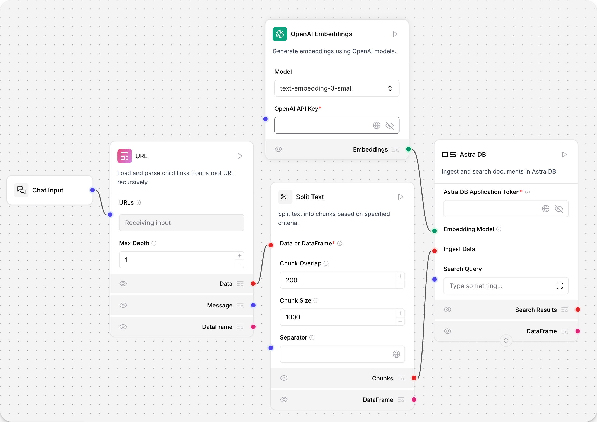


# Helpers(辅助组件)

辅助组件为你的流程提供实用工具函数，用于管理数据、任务和其他组件。

------

## 在流程中使用辅助组件

Langflow 的聊天记忆（Chat memory）可以存储在本地 Langflow 表（通过 LCBufferMemory），也可以连接到外部数据库。

- **Store Message** 辅助组件将聊天记录作为 Data 对象存储。
- **Message History** 辅助组件可以将聊天消息以数据对象或字符串的形式检索出来。

**示例流程**：
使用 AstraDBChatMemory 组件结合 Store Message 和 Chat Memory 组件，实现聊天历史的存储与检索。

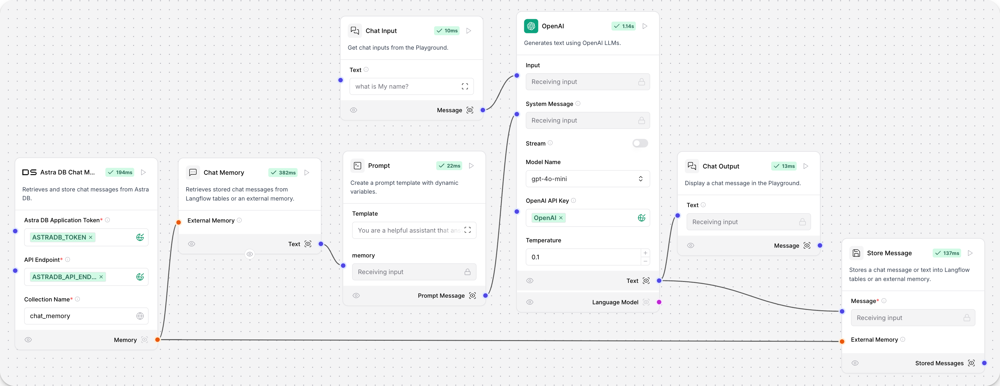

------

## 批量运行（Batch Run）

Batch Run 组件会对 DataFrame 的文本列每一行运行一次语言模型，并返回包含原始文本和 LLM 响应的新 DataFrame。

**响应包含以下列：**

- `text_input`：输入 DataFrame 的原始文本。
- `model_response`：模型对每条输入的响应。
- `batch_index`：处理顺序（从 0 开始）。
- `metadata`（可选）：处理的附加信息。

这些列可通过连接 Parser 组件，在花括号内作为变量使用。

**使用方法：**

1. 将模型组件的 Language model 输出连接到 Batch Run 的 model 输入端口。

2. 将输出 DataFrame 的组件（如 File 组件）连接到 Batch Run 的 DataFrame 输入端口。

3. 将 Batch Run 的 Batch Results 输出连接到 Parser 组件的 DataFrame 输入端口。

4. 在 Batch Run 的 Column Name 字段输入要处理的列名（如 name）。

5. 可选：在 System Message 字段输入系统提示（如“为每个名字创建名片”）。

6. 在 Parser 组件的 Template 字段中，使用新 DataFrame 的列变量，例如：

   ```
   record_number: {batch_index}, name: {text_input}, summary: {model_response}
   
   ```

   在 Parser 组件点击“Run component”运行流程。

7. 可选：连接 Chat Output 组件，在 Playground 查看输出。

**参数**

**输入**

| 名称               | 类型             | 说明                                                         |
| ------------------ | ---------------- | ------------------------------------------------------------ |
| model              | HandleInput      | 连接 LLM 组件的 Language Model 输出。必填。                  |
| system_message     | MultilineInput   | 针对所有行的多行系统指令。                                   |
| df                 | DataFrameInput   | 要处理的 DataFrame，指定 column_name 作为文本消息。必填。    |
| column_name        | MessageTextInput | 要处理为文本消息的 DataFrame 列名。留空则所有列按 TOML 格式。 |
| output_column_name | MessageTextInput | 存储模型响应的列名，默认 model_response。                    |
| enable_metadata    | BoolInput        | 是否在输出 DataFrame 中添加元数据。                          |

**输出**

| 名称          | 类型      | 说明                                     |
| ------------- | --------- | ---------------------------------------- |
| batch_results | DataFrame | 包含所有原始列和模型响应的新 DataFrame。 |

------

## 当前日期（Current Date）

Current Date 组件返回所选时区的当前日期和时间，便于在流程中获取特定时区的时间信息。

**参数**

**输入**

| 名称     | 类型   | 说明               |
| -------- | ------ | ------------------ |
| timezone | String | 当前日期时间的时区 |

**输出**

| 名称         | 类型   | 说明                     |
| ------------ | ------ | ------------------------ |
| current_date | String | 选定时区的当前日期和时间 |

------

## ID 生成器（ID Generator）

该组件用于生成唯一 ID。

**参数**

**输入**

| 名称      | 类型   | 说明          |
| --------- | ------ | ------------- |
| unique_id | String | 生成的唯一 ID |

**输出**

| 名称 | 类型   | 说明          |
| ---- | ------ | ------------- |
| id   | String | 生成的唯一 ID |

------

## 消息历史（Message history）

> Langflow 1.1 之前，该组件名为 Chat Memory 组件。

该组件用于从 Langflow 表或外部内存检索聊天消息。

**参数**

**输入**

| 名称        | 类型    | 说明                                           |
| ----------- | ------- | ---------------------------------------------- |
| memory      | Memory  | 从外部内存检索消息，留空则用 Langflow 表。     |
| sender      | String  | 按发送者类型过滤。                             |
| sender_name | String  | 按发送者名称过滤。                             |
| n_messages  | Integer | 要检索的消息数量。                             |
| session_id  | String  | 聊天会话 ID，留空则用当前会话参数。            |
| order       | String  | 消息排序方式。                                 |
| template    | String  | 格式化数据的模板，可用 {text}、{sender} 等键。 |

**输出**

| 名称          | 类型      | 说明                     |
| ------------- | --------- | ------------------------ |
| messages      | Data      | 检索到的消息 Data 对象   |
| messages_text | Message   | 格式化为文本的消息       |
| dataframe     | DataFrame | 包含消息数据的 DataFrame |

------

## 消息存储（Message store）

该组件将聊天消息或文本存储到 Langflow 表或外部内存。

**参数**

**输入**

| 名称        | 类型   | 说明                                            |
| ----------- | ------ | ----------------------------------------------- |
| message     | String | 要存储的聊天消息（必填）。                      |
| memory      | Memory | 外部内存，留空则用 Langflow 表。                |
| sender      | String | 消息发送者（Machine 或 User），留空用当前参数。 |
| sender_name | String | 发送者名称（AI 或 User），留空用当前参数。      |
| session_id  | String | 聊天会话 ID，留空用当前参数。                   |

**输出**

| 名称            | 类型       | 说明                     |
| --------------- | ---------- | ------------------------ |
| stored_messages | List[Data] | 添加当前消息后的消息列表 |

------

## 结构化输出（Structured output）

该组件将 LLM 响应转换为结构化数据格式。

**示例**：
在财报解析模板中，Structured Output 组件将非结构化财报转为结构化数据。

- 通过 Format Instructions 参数作为系统提示，指导 LLM 输出结构化内容。
- Output Schema 参数定义输出结构和数据类型。

**参数**

**输入**

| 名称          | 类型          | 说明                         |
| ------------- | ------------- | ---------------------------- |
| llm           | LanguageModel | 用于生成结构化输出的语言模型 |
| input_value   | String        | 输入消息                     |
| system_prompt | String        | 格式化输出的系统指令         |
| schema_name   | String        | 输出数据结构名称             |
| output_schema | Table         | 输出结构和数据类型           |
| multiple      | Boolean       | [已弃用] 总为 True           |

**输出**

| 名称              | 类型 | 说明                             |
| ----------------- | ---- | -------------------------------- |
| structured_output | Data | 按定义 schema 结构化的 Data 对象 |

------

## 旧版组件（Legacy components）

这些组件仍可用，但不再维护。

------

## 创建列表（Create List）

该组件动态创建包含指定字段数的记录。

**参数**

**输入**

| 名称     | 类型    | 说明             |
| -------- | ------- | ---------------- |
| n_fields | Integer | 要添加的字段数量 |
| text_key | String  | 用作文本的键     |

**输出**

| 名称 | 类型 | 说明               |
| ---- | ---- | ------------------ |
| list | List | 动态创建的字段列表 |

------

## 输出解析器（Output Parser）

该组件将 LLM 输出转换为指定格式。支持 CSV 格式解析，将 LLM 响应转为逗号分隔列表（使用 Langchain 的 CommaSeparatedListOutputParser）。

> 该组件仅提供格式化指令和解析功能，不包含 prompt。需连接 Prompt 组件创建实际的 prompt 模板。

**Output Parser 与 Structured Output 区别：**
Output Parser 更简单，适合只需列表的场景；Structured Output 更复杂灵活，适合需要多字段和类型的结构化数据。

**使用方法：**

1. 创建 Prompt 组件，将 Output Parser 的 format_instructions 输出连接到 Prompt。

2. 在 Prompt 组件中编写实际提示文本，并包含 {format_instructions} 变量。例如：

   ```
   {format_instructions} 请列举三种水果。
   ```

3. 将 output_parser 输出连接到 LLM 模型。

4. 输出解析器会将响应转为 Python 列表，如 ["apple", "banana", "orange"]。

**参数**

**输入**

| 名称        | 类型   | 说明                       |
| ----------- | ------ | -------------------------- |
| parser_type | String | 解析器类型，目前支持 "CSV" |

**输出**

| 名称                | 类型   | 说明                         |
| ------------------- | ------ | ---------------------------- |
| format_instructions | String | 用于 prompt 模板的格式化指令 |
| output_parser       | Parser | 可用于解析 LLM 响应的解析器  |

# Inputs/Outputs（输入输出组件）

输入和输出组件定义了数据进入和离开你的流程的位置。

这两类组件都接受用户输入并返回一个 Message 对象，但用途不同。

- **Text Input 组件**：只接受文本字符串输入，返回仅包含输入文本的 Message 对象。其输出不会显示在 Playground 中。
- **Chat Input 组件**：可接受多种输入类型，包括文本、文件和元数据，返回包含文本、发送者信息、会话 ID 和文件附件的 Message 对象。

Chat Input 组件在 Playground 中提供交互式聊天界面。

---

## Chat Input

该组件从聊天中收集用户输入的文本字符串，并将其封装为包含输入文本、发送者信息、会话 ID、文件附件和样式属性的 Message 对象。

它还可以选择性地将消息存储到聊天历史中。

**参数**

**输入**

| 名称                 | 显示名称         | 说明                                        |
| -------------------- | ---------------- | ------------------------------------------- |
| input_value          | Text             | 作为输入传递的消息。                        |
| should_store_message | Store Messages   | 是否将消息存储到历史记录。                  |
| sender               | Sender Type      | 发送者类型。                                |
| sender_name          | Sender Name      | 发送者名称。                                |
| session_id           | Session ID       | 聊天会话唯一标识符。留空则使用当前会话 ID。 |
| files                | Files            | 随消息发送的文件。                          |
| background_color     | Background Color | 图标的背景色。                              |
| chat_icon            | Icon             | 消息的图标。                                |
| text_color           | Text Color       | 名称的文字颜色。                            |

**输出**

| 名称    | 显示名称 | 说明                             |
| ------- | -------- | -------------------------------- |
| message | Message  | 包含所有指定属性的聊天消息对象。 |

**Message 方法**

ChatInput 类提供异步方法，根据输入参数创建并存储 Message 对象。Message 对象通过 ChatInput 类的 message_response 方法，使用 Message.create() 工厂方法创建：

```python
message = await Message.create(
    text=self.input_value,
    sender=self.sender,
    sender_name=self.sender_name,
    session_id=self.session_id,
    files=self.files,
    properties={
        "background_color": background_color,
        "text_color": text_color,
        "icon": icon,
    },
)
```

## Text Input

Text Input 组件接受文本字符串输入，并返回仅包含输入文本的 Message 对象。

其输出不会显示在 Playground 中。

**参数**

**输入**

| 名称        | 显示名称 | 说明                     |
| ----------- | -------- | ------------------------ |
| input_value | Text     | 作为输出传递的文本内容。 |

**输出**

| 名称 | 显示名称 | 说明           |
| ---- | -------- | -------------- |
| text | Text     | 结果文本消息。 |

## Chat Output

Chat Output 组件创建包含输入文本、发送者信息、会话 ID 和样式属性的 Message 对象。

该组件可接受以下输入类型：

- Data
- DataFrame
- Message

**参数**

**输入**

| 名称                 | 显示名称         | 说明                                         |
| -------------------- | ---------------- | -------------------------------------------- |
| input_value          | Text             | 作为输出传递的消息。                         |
| should_store_message | Store Messages   | 是否将消息存储到历史记录。                   |
| sender               | Sender Type      | 发送者类型。                                 |
| sender_name          | Sender Name      | 发送者名称。                                 |
| session_id           | Session ID       | 聊天会话唯一标识符。留空则使用当前会话 ID。  |
| data_template        | Data Template    | 将 Data 转为文本的模板。留空则动态设置。     |
| background_color     | Background Color | 图标的背景色。                               |
| chat_icon            | Icon             | 消息的图标。                                 |
| text_color           | Text Color       | 名称的文字颜色。                             |
| clean_data           | Basic Clean Data | 启用时，DataFrame 输入转为文本时会清理数据。 |

**输出**

| 名称    | 显示名称 | 说明                             |
| ------- | -------- | -------------------------------- |
| message | Message  | 包含所有指定属性的聊天消息对象。 |

------

## Text Output

Text Output 组件接受单个文本输入，并返回包含该文本的 Message 对象。

其输出不会显示在 Playground 中。

**参数**

**输入**

| 名称        | 显示名称 | 说明                     |
| ----------- | -------- | ------------------------ |
| input_value | Text     | 作为输出传递的文本内容。 |

**输出**

| 名称 | 显示名称 | 说明           |
| ---- | -------- | -------------- |
| text | Text     | 结果文本消息。 |

## 聊天组件示例流程

要在流程中使用 Chat Input 和 Chat Output 组件，将它们连接到接受或发送 Message 类型的组件。

**示例：**
将 Chat Input 组件连接到 OpenAI 模型组件的 Input 端口，再将 OpenAI 模型组件的 Message 端口连接到 Chat Output 组件。

在 OpenAI 模型组件的 OpenAI API Key 字段中填写你的 OpenAI API 密钥。

流程如下图所示：

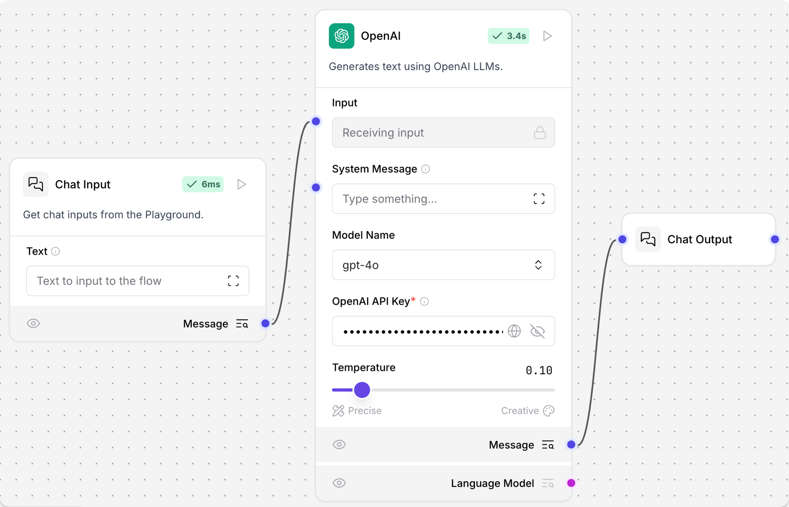

在 Playground 中输入消息，OpenAI 模型组件会响应。你还可以在 OpenAI 模型组件中输入 System Message 控制模型回复。

在 Langflow UI 中，点击流程名称，再点击 Logs 打开日志面板，可查看组件日志。

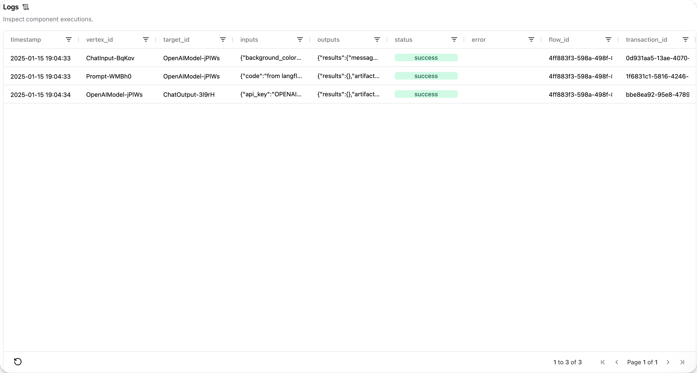

**消息示例：**

- 第一条消息由 Chat Input 组件发送到 OpenAI 模型组件：

```
  "messages": [
    {
      "message": "What's the recommended way to install Docker on Mac M1?",
      "sender": "User",
      "sender_name": "User",
      "session_id": "Session Apr 21, 17:37:04",
      "stream_url": null,
      "component_id": "ChatInput-4WKag",
      "files": [],
      "type": "text"
    }
  ],

```


- 第二条消息由 OpenAI 模型组件发送到 Chat Output 组件：

```
  "outputs":
    "text_output":
      "message": "To install Docker on a Mac with an M1 chip, you should use Docker Desktop for Mac, which is optimized for Apple Silicon. Here's a step-by-step guide to installing Docker on your M1 Mac:\n\n1.
      ...
      "type": "text"

```

**提示：**
如需查看流程中每个组件的输出，可点击 Inspect output。

## 通过 API 发送聊天消息

Chat Input 组件通常是向 Langflow API 传递消息的入口。要通过编程方式向 Langflow 服务器发送消息：

1. 获取 Langflow 端点：点击 Publish，再点击 API access。
2. 复制 cURL 标签中的命令，在终端粘贴并运行。例如：

```json
curl --request POST \
  --url 'http://localhost:7860/api/v1/run/51eed711-4530-4fdc-9bce-5db4351cc73a?stream=false' \
  --header 'Content-Type: application/json' \
  --data '{
  "input_value": "What's the recommended way to install Docker on Mac M1?",
  "output_type": "chat",
  "input_type": "chat"
}'

```

3. 修改 input_value 为你的问题，例如 What's the recommended way to install Docker on Mac M1?。

注意 message 中的 output_type 和 input_type 参数。chat 类型提供更多配置选项，消息会显示在 Playground；text 类型只返回文本字符串，不显示在 Playground。

4. 添加自定义 session_id：

```json
curl --request POST \
  --url 'http://localhost:7860/api/v1/run/51eed711-4530-4fdc-9bce-5db4351cc73a?stream=false' \
  --header 'Content-Type: application/json' \
  --data '{
  "input_value": "Whats the recommended way to install Docker on Mac M1",
  "session_id": "docker-question-on-m1",
  "output_type": "chat",
  "input_type": "chat"
}'

```

自定义 session_id 可用于在客户端与 Langflow 服务器之间开启新的聊天会话，便于区分不同对话和 AI 上下文。

5. 发送 POST 请求，收到回复。

6. 打开 Playground，会看到名为 docker-question-on-m1 的新聊天会话。

7. 如需通过 Tweaks 修改 Chat Input 和 Chat Output 组件参数，点击 Publish，再点击 API access，点击 Tweaks 修改组件数据对象参数。例如，禁用 Chat Input 组件的消息存储：

```json
curl --request POST \
  --url 'http://localhost:7860/api/v1/run/51eed711-4530-4fdc-9bce-5db4351cc73a?stream=false' \
  --header 'Content-Type: application/json' \
  --data '{
  "input_value": "Text to input to the flow",
  "output_type": "chat",
  "input_type": "chat",
  "tweaks": {
    "ChatInput-4WKag": {
      "should_store_message": false
    }
  }
}'
```


在 Logs 面板查看 Chat Input 组件的请求，确认 should_store_message 为 false。

# Logic(逻辑组件)

逻辑组件为流程提供路由、条件处理和流程管理等功能。

**## 在流程中使用逻辑组件**

下面的流程示例使用 Loop 组件创建了一个“逐条总结”的 for-each 循环。

该组件会遍历 Data 对象列表，直到处理完成，然后 Done 循环会聚合结果。

File 组件从本地加载文本文件，Parser 组件将其解析为结构化 Data 对象列表。Loop 组件将每个 Data 对象传递给 Prompt 进行摘要。

当 Loop 组件处理完所有 Data 后，Done 循环会激活，统计页面数量并用另一个 Prompt 总结整体语气。这在 Langflow 中通过将 Parser 组件的 Data List 输出连接到 Loop 组件的 Data loop 输入实现。

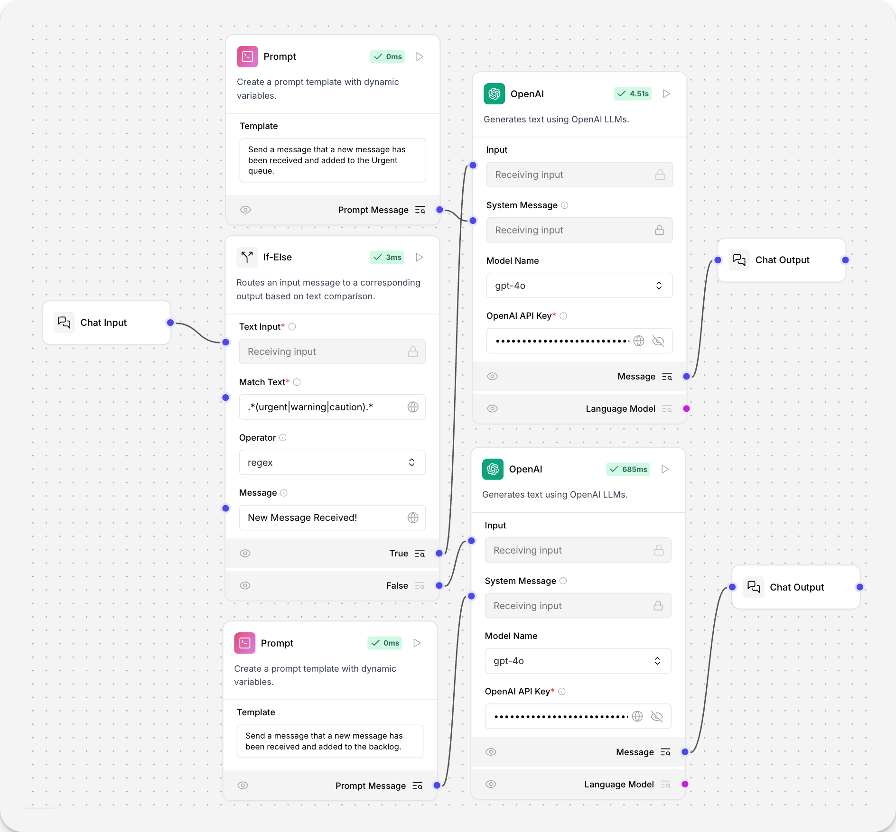


---

## 条件路由器（If-Else 组件）

该组件通过比较两个字符串来路由消息。它根据指定的操作符比较两个文本输入，并将消息路由到 true_result 或 false_result。

操作符可基于你的定义行为查找单个字符串，也可通过正则表达式匹配多个词。

**使用方法：**

1. 将 If-Else 组件的 Text Input 端口连接到 Chat Input 组件。
2. 在 If-Else 组件中设置如下参数：
   - Match Text 字段输入 `.*(urgent|warning|caution).*`，用于查找这些词。正则匹配区分大小写，如需匹配所有写法可用 `warning|Warning|WARNING`。
   - Operator 字段输入 `regex`，表示使用正则匹配。
   - Message 字段输入 `New Message Detected`（可选），消息会发送到 True 和 False 端口。
3. 创建两条相同的流程分别处理 True 和 False 路径。每条链路连接 OpenAI 组件、Prompt 和 Chat Output。
4. 将一条链路连接到 If-Else 的 True 端口，另一条连接到 False 端口。
5. 在两个 OpenAI 组件中填写 API Key。
6. 在两个 Prompt 组件中分别输入不同的行为说明。

**示例行为：**

- 匹配到关键词时：  
  发送“新消息已收到并加入紧急队列”。
- 未匹配到时：  
  发送“新消息已收到并加入待处理队列”。

**示例对话：**

用户：A new user was created.  
AI：新消息已收到并加入待处理队列。

用户：Sign-in warning: new user locked out.  
AI：新消息已收到并加入紧急队列，请尽快处理。

**参数**

**输入**

| 名称           | 类型     | 说明                                                         |
| -------------- | -------- | ------------------------------------------------------------ |
| input_text     | String   | 主要文本输入。                                               |
| match_text     | String   | 用于比较的文本。                                             |
| operator       | Dropdown | 用于比较文本的操作符。包括 equals, not equals, contains, starts with, ends with, regex。默认 equals。 |
| case_sensitive | Boolean  | 是否区分大小写（regex 不受影响）。默认 false。               |
| message        | Message  | 要传递的消息。                                               |
| max_iterations | Integer  | 条件路由器允许的最大迭代次数，默认 10。                      |
| default_route  | Dropdown | 达到最大迭代次数时的路由，true_result 或 false_result，默认 false_result。 |

**输出**

| 名称         | 类型    | 说明               |
| ------------ | ------- | ------------------ |
| true_result  | Message | 条件为真时的输出。 |
| false_result | Message | 条件为假时的输出。 |

**操作符行为说明**

- equals：完全相等
- not equals：不相等
- contains：input_text 是否包含 match_text
- starts with：input_text 是否以 match_text 开头
- ends with：input_text 是否以 match_text 结尾
- regex：正则表达式匹配（始终区分大小写，忽略 case_sensitive 设置）

---

## Listen（监听）

该组件监听通知并获取其关联状态。

**参数**

**输入**

| 名称 | 类型   | 说明           |
| ---- | ------ | -------------- |
| name | String | 要监听的通知名 |

**输出**

| 名称   | 类型 | 说明               |
| ------ | ---- | ------------------ |
| output | Data | 通知关联的状态数据 |

---

## Loop（循环）

> 更多 Loop 组件示例见 Research Translation Loop 模板。

该组件遍历 Data 对象列表，每次输出一个条目，并聚合循环输入的结果。

**示例**：  
Loop 组件遍历 CSV 文件的每一行，直到处理完所有行。Done 端口连接的操作会在所有条目处理完后执行（如加载到 Chroma DB）。

- Loop 组件从 Load CSV 组件接收 Data，并从 Item 端口输出数据。
- 每一行 CSV 转为 Message，并用 Structured Output 组件处理为结构化数据。Structured Output 的 Looping 端口虚线连接，表示循环起点。
- Loop 组件会按 Text Key 反复提取行，直到没有更多行。

所有条目处理完后，Done 端口的操作会被执行。

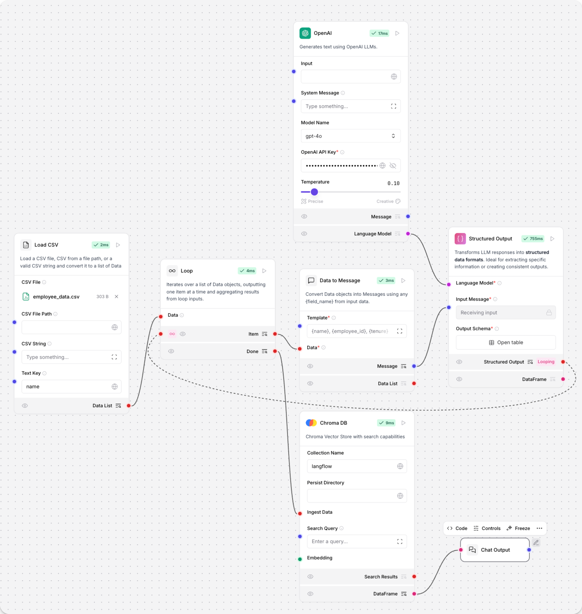


**参数**

**输入**

| 名称 | 类型      | 说明                   |
| ---- | --------- | ---------------------- |
| data | Data/List | 要处理的 Data 对象列表 |

**输出**

| 名称 | 类型 | 说明                       |
| ---- | ---- | -------------------------- |
| item | Data | 当前处理的 Data 条目       |
| done | Data | 所有条目处理完后的聚合结果 |

---

## Notify（通知）

该组件为 Listen 组件生成通知。

**参数**

**输入**

| 名称   | 类型    | 说明                   |
| ------ | ------- | ---------------------- |
| name   | String  | 通知名称               |
| data   | Data    | 要存储在通知中的数据   |
| append | Boolean | 是否追加到现有通知记录 |

**输出**

| 名称   | 类型 | 说明               |
| ------ | ---- | ------------------ |
| output | Data | 存储在通知中的数据 |

---

## Pass（转发）

该组件原样转发输入消息，不做更改。

**参数**

**输入**

| 名称            | 显示名称        | 说明                                 |
| --------------- | --------------- | ------------------------------------ |
| input_message   | Input Message   | 要转发的消息                         |
| ignored_message | Ignored Message | 被忽略的第二条消息（用于流程连续性） |

**输出**

| 名称           | 显示名称       | 说明           |
| -------------- | -------------- | -------------- |
| output_message | Output Message | 转发的输入消息 |

---

## Run flow（运行流程）

该组件允许你运行 Langflow 数据库中存储的任意流程，无需打开流程编辑器。

Run Flow 组件也可作为工具连接到 Agent。当你选择流程时，组件会获取流程的图结构，并据此生成输入输出。

**用法：**

1. 将 Run Flow 组件添加到 Simple Agent 流程。
2. 在 Flow Name 菜单选择要运行的子流程，Run Flow 组件会自动反映所选流程的输入输出。
3. 启用 Tool Mode。
4. 将 Run Flow 组件连接到 Agent 的 Toolset 输入。
5. 运行流程，Agent 会用 Run Flow 组件作为工具运行所选子流程。

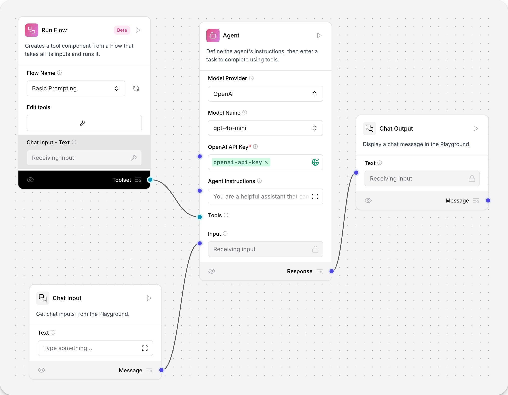

**参数**

**输入**

| 名称               | 类型     | 说明                             |
| ------------------ | -------- | -------------------------------- |
| flow_name_selected | Dropdown | 要运行的流程名称                 |
| flow_tweak_data    | Dict     | 用于自定义流程行为的 tweaks 字典 |
| dynamic inputs     | Various  | 根据所选流程动态生成的其他输入   |

**输出**

| 名称        | 类型（Data、Message、DataFrame 列表） | 说明                     |
| ----------- | ------------------------------------- | ------------------------ |
| run_outputs | List                                  | 运行流程后生成的所有输出 |

# Memory 组件

Memory 组件通过 session_id 存储和检索聊天消息。

它们不同于向量存储组件，因为 Memory 组件专为从外部数据库存储和检索聊天消息而设计。

Memory 组件为各自的外部数据库提供内存访问。这使得大语言模型（LLM）或智能体能够访问外部内存，实现持久化和上下文保持。

---

## 在流程中使用 Memory 组件

以下示例流程通过 Astra DB Chat Memory 组件结合 Store Message 和 Message History 组件，实现聊天历史的存储与检索。

- Store Message 辅助组件将聊天记录作为 Data 对象存储。
- Message History 辅助组件可以将聊天消息以 Data 对象或字符串形式检索。

**示例：在 AstraDB 中存储消息历史**


---

## AstraDBChatMemory 组件

该组件创建一个 AstraDBChatMessageHistory 实例，使用 Astra DB（云原生数据库服务）存储和检索聊天消息。

**参数**

**输入**

| 名称            | 类型         | 说明                                          |
| --------------- | ------------ | --------------------------------------------- |
| collection_name | String       | Astra DB 中用于存储消息的集合名。必填。       |
| token           | SecretString | Astra DB 访问认证令牌。必填。                 |
| api_endpoint    | SecretString | Astra DB 服务的 API 端点 URL。必填。          |
| namespace       | String       | Astra DB 中集合的命名空间（可选）。           |
| session_id      | MessageText  | 聊天会话唯一标识符。未提供时使用当前会话 ID。 |

**输出**

| 名称            | 类型                   | 说明                                      |
| --------------- | ---------------------- | ----------------------------------------- |
| message_history | BaseChatMessageHistory | 当前会话的 AstraDBChatMessageHistory 实例 |

---

## CassandraChatMemory 组件

该组件创建 CassandraChatMessageHistory 实例，支持使用 Apache Cassandra 或 DataStax Astra DB 存储和检索聊天消息。

**参数**

**输入**

| 名称           | 类型         | 说明                                                         |
| -------------- | ------------ | ------------------------------------------------------------ |
| database_ref   | MessageText  | Cassandra 数据库的 contact points 或 Astra DB 的数据库 ID。必填。 |
| username       | MessageText  | Cassandra 用户名。Astra DB 可留空。                          |
| token          | SecretString | Cassandra 密码或 Astra DB 令牌。必填。                       |
| keyspace       | MessageText  | Cassandra 的 keyspace 或 Astra DB 的 namespace。必填。       |
| table_name     | MessageText  | 用于存储消息的表名或集合名。必填。                           |
| session_id     | MessageText  | 聊天会话唯一标识符。可选。                                   |
| cluster_kwargs | Dictionary   | Cassandra 集群配置的其他参数。可选。                         |

**输出**

| 名称            | 类型                   | 说明                                        |
| --------------- | ---------------------- | ------------------------------------------- |
| message_history | BaseChatMessageHistory | 当前会话的 CassandraChatMessageHistory 实例 |

---

## Mem0 Chat Memory

Mem0 Chat Memory 组件通过 Mem0 内存存储和检索聊天消息。

**参数**

**输入**

| 名称            | 显示名称                 | 说明                                         |
| --------------- | ------------------------ | -------------------------------------------- |
| mem0_config     | Mem0 Configuration       | 初始化 Mem0 内存实例的配置字典。             |
| ingest_message  | Message to Ingest        | 要写入 Mem0 内存的消息内容。                 |
| existing_memory | Existing Memory Instance | 可选，已有的 Mem0 内存实例。                 |
| user_id         | User ID                  | 与消息关联的用户标识。                       |
| search_query    | Search Query             | 用于在 Mem0 中搜索相关记忆的输入文本。       |
| mem0_api_key    | Mem0 API Key             | Mem0 平台的 API 密钥。留空则使用本地版本。   |
| metadata        | Metadata                 | 与写入消息关联的附加元数据。                 |
| openai_api_key  | OpenAI API Key           | OpenAI 的 API 密钥。使用 OpenAI 嵌入时必填。 |

**输出**

| 名称           | 显示名称       | 说明                            |
| -------------- | -------------- | ------------------------------- |
| memory         | Mem0 Memory    | 写入数据后的 Mem0 Memory 对象。 |
| search_results | Search Results | 查询 Mem0 内存的搜索结果。      |

---

## Redis Chat Memory

该组件用于从 Redis 存储和检索聊天消息。

**参数**

**输入**

| 名称       | 显示名称   | 说明                 |
| ---------- | ---------- | -------------------- |
| host       | hostname   | IP 地址或主机名      |
| port       | port       | Redis 端口号         |
| database   | database   | Redis 数据库编号     |
| username   | Username   | Redis 用户名         |
| password   | Password   | 用户名对应的密码     |
| key_prefix | Key prefix | 键前缀               |
| session_id | Session ID | 消息的唯一会话标识符 |

**输出**

| 名称   | 显示名称 | 说明                   |
| ------ | -------- | ---------------------- |
| memory | Memory   | Redis 聊天消息历史对象 |

---

# Models(模型)

模型组件使用大语言模型（LLM）生成文本。

有关参数的详细信息，请参考你所用组件的具体文档。

---

## 在流程中使用模型组件

模型组件接收输入和提示词用于生成文本，生成的文本会发送到输出组件。

模型输出也可以发送到 Language Model 端口，再传递给 Parse Data 组件，将输出解析为结构化 Data 对象。

下图为 OpenAI 模型在聊天机器人流程中的示例。

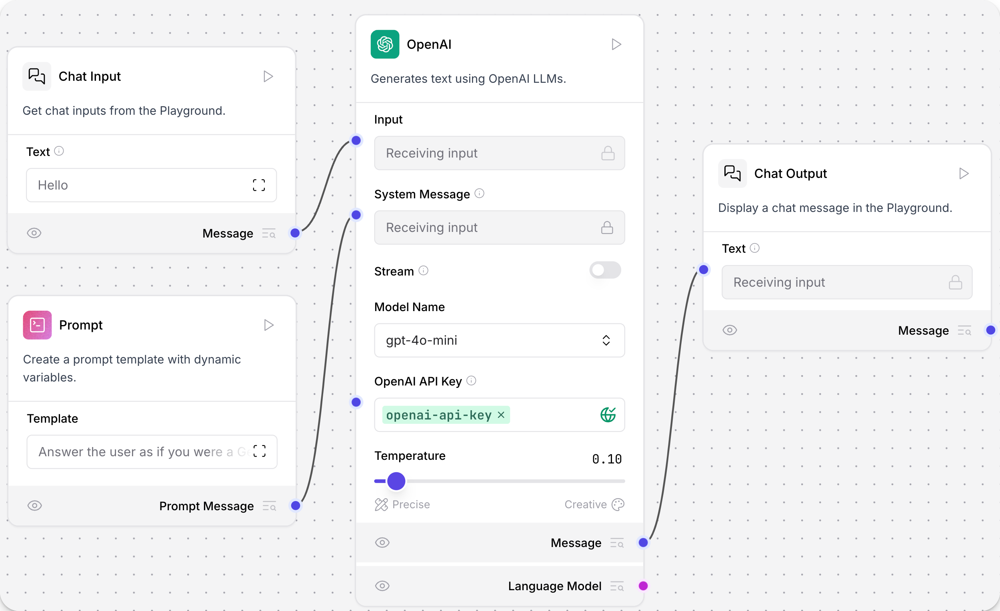

## AIML

该组件通过 AIML API 创建 ChatOpenAI 模型实例。

**参数**

**输入**

| 名称          | 类型         | 说明                                               |
| ------------- | ------------ | -------------------------------------------------- |
| max_tokens    | Integer      | 生成的最大 token 数，0 表示无限制，范围 0-128000。 |
| model_kwargs  | Dictionary   | 传递给模型的其他关键字参数。                       |
| model_name    | String       | AIML 模型名称，选项见 AIML_CHAT_MODELS。           |
| aiml_api_base | String       | AIML API 基础 URL，默认 https://api.aimlapi.com。  |
| api_key       | SecretString | AIML API Key。                                     |
| temperature   | Float        | 控制输出的随机性，默认 0.1。                       |

**输出**

| 名称  | 类型          | 说明                     |
| ----- | ------------- | ------------------------ |
| model | LanguageModel | 配置好的 ChatOpenAI 实例 |

---

## Amazon Bedrock

该组件使用 Amazon Bedrock LLM 生成文本。

**参数**

**输入**

| 名称                     | 类型         | 说明                         |
| ------------------------ | ------------ | ---------------------------- |
| model_id                 | String       | Amazon Bedrock 模型 ID。     |
| aws_access_key           | SecretString | AWS 访问密钥。               |
| aws_secret_key           | SecretString | AWS 密钥。                   |
| aws_session_token        | SecretString | AWS 会话密钥。               |
| credentials_profile_name | String       | AWS 凭证配置文件名。         |
| region_name              | String       | AWS 区域，默认 us-east-1。   |
| model_kwargs             | Dictionary   | 其他关键字参数。             |
| endpoint_url             | String       | Bedrock 服务自定义端点 URL。 |

**输出**

| 名称  | 类型          | 说明                      |
| ----- | ------------- | ------------------------- |
| model | LanguageModel | 配置好的 ChatBedrock 实例 |

---

## Anthropic

该组件支持使用 Anthropic Chat 和 Language 模型生成文本。

**参数**

**输入**

| 名称              | 类型         | 说明                                                         |
| ----------------- | ------------ | ------------------------------------------------------------ |
| max_tokens        | Integer      | 生成的最大 token 数，0 表示无限制，默认 4096。               |
| model             | String       | Anthropic 模型名称，支持多种 Claude 3。                      |
| anthropic_api_key | SecretString | Anthropic API Key。                                          |
| temperature       | Float        | 控制输出随机性，默认 0.1。                                   |
| anthropic_api_url | String       | Anthropic API 端点，默认 https://api.anthropic.com（高级）。 |
| prefill           | String       | 预填充文本，引导模型回复（高级）。                           |

**输出**

| 名称  | 类型          | 说明                        |
| ----- | ------------- | --------------------------- |
| model | LanguageModel | 配置好的 ChatAnthropic 实例 |

---

## Azure OpenAI

该组件使用 Azure OpenAI LLM 生成文本。

**参数**

**输入**

| 名称            | 类型         | 说明                           |
| --------------- | ------------ | ------------------------------ |
| Model Name      | String       | Azure OpenAI 模型名称。        |
| Azure Endpoint  | String       | Azure 端点（含资源名）。       |
| Deployment Name | String       | 部署名称。                     |
| API Version     | String       | API 版本。                     |
| API Key         | SecretString | Azure OpenAI API Key。         |
| Temperature     | Float        | 采样温度，默认 0.7。           |
| Max Tokens      | Integer      | 最大生成 token 数，默认 1000。 |
| Input Value     | String       | 输入文本。                     |
| Stream          | Boolean      | 是否流式返回，默认 False。     |

**输出**

| 名称  | 类型          | 说明                      |
| ----- | ------------- | ------------------------- |
| model | LanguageModel | 配置好的 AzureOpenAI 实例 |

---

## Cohere

该组件使用 Cohere 语言模型生成文本。

**参数**

**输入**

| 名称           | 类型         | 说明                          |
| -------------- | ------------ | ----------------------------- |
| Cohere API Key | SecretString | Cohere API Key。              |
| Max Tokens     | Integer      | 最大生成 token 数，默认 256。 |
| Temperature    | Float        | 采样温度，默认 0.75。         |
| Input Value    | String       | 输入文本。                    |

**输出**

| 名称  | 类型          | 说明                 |
| ----- | ------------- | -------------------- |
| model | LanguageModel | 配置好的 Cohere 实例 |

---

## DeepSeek

该组件使用 DeepSeek 语言模型生成文本。

**参数**

**输入**

| 名称         | 类型         | 说明                                             |
| ------------ | ------------ | ------------------------------------------------ |
| max_tokens   | Integer      | 最大生成 token 数，0 表示无限制。范围 0-128000。 |
| model_kwargs | Dictionary   | 其他关键字参数。                                 |
| json_mode    | Boolean      | 若为 True，无论是否传 schema 都输出 JSON。       |
| model_name   | String       | DeepSeek 模型名称，默认 deepseek-chat。          |
| api_base     | String       | API 基础 URL，默认 https://api.deepseek.com。    |
| api_key      | SecretString | DeepSeek API Key。                               |
| temperature  | Float        | 控制输出随机性，范围 [0.0, 2.0]，默认 1.0。      |
| seed         | Integer      | 随机种子，相同种子结果更可复现。                 |

**输出**

| 名称  | 类型          | 说明                     |
| ----- | ------------- | ------------------------ |
| model | LanguageModel | 配置好的 ChatOpenAI 实例 |

---

## Google Generative AI

该组件使用 Google 生成式 AI 模型生成文本。

**参数**

**输入**

| 名称              | 类型         | 说明                        |
| ----------------- | ------------ | --------------------------- |
| Google API Key    | SecretString | Google API Key。            |
| Model             | String       | 模型名称，如 "gemini-pro"。 |
| Max Output Tokens | Integer      | 最大生成 token 数。         |
| Temperature       | Float        | 采样温度。                  |
| Top K             | Integer      | 采样时考虑的 top K token。  |
| Top P             | Float        | 采样时累计概率阈值。        |
| N                 | Integer      | 每个提示生成的聊天补全数。  |

**输出**

| 名称  | 类型          | 说明                                 |
| ----- | ------------- | ------------------------------------ |
| model | LanguageModel | 配置好的 ChatGoogleGenerativeAI 实例 |

---

## Groq

该组件使用 Groq 语言模型生成文本。

**用法**：  
在 Groq API Key 字段粘贴你的 Groq API Key。Groq 组件会自动获取最新模型列表。  
在 Model 字段选择模型，如 llama-3.1-8b-instant。  
在 Prompt 组件输入提示词，如：

```
You are a helpful assistant who supports their claims with sources.
```

点击 Playground，向 Groq LLM 提问，响应会包含来源列表。

**参数**

**输入**

| 名称              | 类型         | 说明                                      |
| ----------------- | ------------ | ----------------------------------------- |
| groq_api_key      | SecretString | Groq API Key。                            |
| groq_api_base     | String       | API 基础 URL，默认 https://api.groq.com。 |
| max_tokens        | Integer      | 最大生成 token 数。                       |
| temperature       | Float        | 控制输出随机性，默认 0.1。                |
| n                 | Integer      | 每个提示生成的聊天补全数。                |
| model_name        | String       | Groq 模型名称，动态获取。                 |
| tool_mode_enabled | Bool         | 启用后仅显示支持工具的模型。              |

**输出**

| 名称  | 类型          | 说明                   |
| ----- | ------------- | ---------------------- |
| model | LanguageModel | 配置好的 ChatGroq 实例 |

---

## Hugging Face API

该组件通过 Hugging Face API 生成文本。

**参数**

**输入**

| 名称                     | 类型         | 说明                                    |
| ------------------------ | ------------ | --------------------------------------- |
| model_id                 | String       | Hugging Face Hub 的模型 ID，如 "gpt2"。 |
| huggingfacehub_api_token | SecretString | Hugging Face API Token。                |
| temperature              | Float        | 控制输出随机性，默认 0.7。              |
| max_new_tokens           | Integer      | 最大生成 token 数，默认 512。           |
| top_p                    | Float        | nucleus 采样参数，默认 0.95。           |
| top_k                    | Integer      | top-k 采样参数，默认 50。               |
| model_kwargs             | Dictionary   | 其他关键字参数。                        |

**输出**

| 名称  | 类型          | 说明                         |
| ----- | ------------- | ---------------------------- |
| model | LanguageModel | 配置好的 HuggingFaceHub 实例 |

---

## IBM watsonx.ai

该组件使用 IBM watsonx.ai 基础模型生成文本。

**参数**

**输入**

| 名称              | 类型         | 说明                                    |
| ----------------- | ------------ | --------------------------------------- |
| url               | String       | watsonx API 基础 URL。                  |
| project_id        | String       | watsonx 项目 ID。                       |
| api_key           | SecretString | IBM watsonx API Key。                   |
| model_name        | String       | watsonx 模型名称，API 动态获取。        |
| max_tokens        | Integer      | 最大生成 token 数，默认 1000。          |
| stop_sequence     | String       | 生成停止的序列。                        |
| temperature       | Float        | 控制输出随机性，默认 0.1。              |
| top_p             | Float        | nucleus 采样，默认 0.9。                |
| frequency_penalty | Float        | 频率惩罚，默认 0.5。                    |
| presence_penalty  | Float        | 新话题惩罚，默认 0.3。                  |
| seed              | Integer      | 随机种子，默认 8。                      |
| logprobs          | Boolean      | 是否返回输出 token 的概率，默认 True。  |
| top_logprobs      | Integer      | 每个位置返回最可能的 token 数，默认 3。 |
| logit_bias        | String       | token ID 的偏置 JSON 字符串。           |

**输出**

| 名称  | 类型          | 说明                      |
| ----- | ------------- | ------------------------- |
| model | LanguageModel | 配置好的 ChatWatsonx 实例 |

---

## Language model

该组件可用 OpenAI 或 Anthropic 语言模型生成文本。

作为 LLM 的通用替代组件，可在不同模型提供商间切换，无需更换组件。

**参数**

**输入**

| 名称           | 类型         | 说明                                                 |
| -------------- | ------------ | ---------------------------------------------------- |
| provider       | String       | 模型提供商，"OpenAI" 或 "Anthropic"。默认 "OpenAI"。 |
| model_name     | String       | 模型名称，取决于所选提供商。                         |
| api_key        | SecretString | API Key。                                            |
| input_value    | String       | 输入文本。                                           |
| system_message | String       | 系统消息，设置助手行为（高级）。                     |
| stream         | Boolean      | 是否流式返回，默认 False（高级）。                   |
| temperature    | Float        | 控制输出随机性，默认 0.1（高级）。                   |

**输出**

| 名称  | 类型          | 说明                                      |
| ----- | ------------- | ----------------------------------------- |
| model | LanguageModel | 配置好的 ChatOpenAI 或 ChatAnthropic 实例 |

---

## LMStudio

该组件使用 LM Studio 本地语言模型生成文本。

**参数**

**输入**

| 名称              | 类型         | 说明                                               |
| ----------------- | ------------ | -------------------------------------------------- |
| base_url          | String       | LM Studio 运行的 URL，默认 http://localhost:1234。 |
| max_tokens        | Integer      | 最大生成 token 数，默认 512。                      |
| temperature       | Float        | 控制输出随机性，默认 0.7。                         |
| top_p             | Float        | nucleus 采样，默认 1.0。                           |
| stop              | List[String] | 遇到这些字符串时停止生成。                         |
| stream            | Boolean      | 是否流式返回，默认 False。                         |
| presence_penalty  | Float        | 惩罚重复 token，默认 0.0。                         |
| frequency_penalty | Float        | 惩罚频繁 token，默认 0.0。                         |

**输出**

| 名称  | 类型          | 说明                   |
| ----- | ------------- | ---------------------- |
| model | LanguageModel | 配置好的 LMStudio 实例 |

---

## Maritalk

该组件使用 Maritalk LLM 生成文本。

**参数**

**输入**

| 名称         | 类型         | 说明                                               |
| ------------ | ------------ | -------------------------------------------------- |
| max_tokens   | Integer      | 最大生成 token 数，0 表示无限制，默认 512。        |
| model_name   | String       | Maritalk 模型名称，默认 sabia-2-small。            |
| api_key      | SecretString | Maritalk API Key。                                 |
| temperature  | Float        | 控制输出随机性，默认 0.5。                         |
| endpoint_url | String       | Maritalk API 端点，默认 https://api.maritalk.com。 |

**输出**

| 名称  | 类型          | 说明                       |
| ----- | ------------- | -------------------------- |
| model | LanguageModel | 配置好的 ChatMaritalk 实例 |

---

## Mistral

该组件使用 MistralAI LLM 生成文本。

---

## Novita AI

该组件使用 Novita AI 语言模型生成文本。

**参数**

**输入**

| 名称              | 类型         | 说明                              |
| ----------------- | ------------ | --------------------------------- |
| api_key           | SecretString | Novita AI API Key。               |
| model             | String       | Novita AI 模型 ID。               |
| max_tokens        | Integer      | 最大生成 token 数，0 表示无限制。 |
| temperature       | Float        | 控制输出随机性，默认 0.7。        |
| top_p             | Float        | nucleus 采样，默认 1.0。          |
| frequency_penalty | Float        | 频率惩罚，默认 0.0。              |
| presence_penalty  | Float        | 新话题惩罚，默认 0.0。            |

**输出**

| 名称  | 类型          | 说明                    |
| ----- | ------------- | ----------------------- |
| model | LanguageModel | 配置好的 Novita AI 实例 |

---

## NVIDIA

该组件使用 NVIDIA LLM 生成文本。

**参数**

**输入**

| 名称           | 类型         | 说明                                                         |
| -------------- | ------------ | ------------------------------------------------------------ |
| max_tokens     | Integer      | 最大生成 token 数，0 表示无限制。                            |
| model_name     | String       | NVIDIA 模型名称，默认 mistralai/mixtral-8x7b-instruct-v0.1。 |
| base_url       | String       | NVIDIA API 基础 URL，默认 https://integrate.api.nvidia.com/v1。 |
| nvidia_api_key | SecretString | NVIDIA API Key。                                             |
| temperature    | Float        | 控制输出随机性，默认 0.1。                                   |
| seed           | Integer      | 随机种子，默认 1。                                           |

**输出**

| 名称  | 类型          | 说明                     |
| ----- | ------------- | ------------------------ |
| model | LanguageModel | 配置好的 ChatNVIDIA 实例 |

---

## Ollama

该组件使用 Ollama 语言模型生成文本。

**用法**：  
将 Langflow 连接到本地运行的 Ollama 服务器并选择模型。  
Base URL 字段填写本地 Ollama 服务器地址，默认 http://localhost:11434。  
点击 Refresh 可刷新模型列表。  
Model Name 字段选择模型，如 llama3.2:latest。

**参数**

**输入**

| 名称        | 类型   | 说明                 |
| ----------- | ------ | -------------------- |
| Base URL    | String | Ollama API 端点      |
| Model Name  | String | 使用的模型名称       |
| Temperature | Float  | 控制模型回复的创造性 |

**输出**

| 名称  | 类型          | 说明                 |
| ----- | ------------- | -------------------- |
| model | LanguageModel | 配置好的 Ollama 实例 |

---

## OpenAI

该组件使用 OpenAI 语言模型生成文本。

**参数**

**输入**

| 名称              | 类型         | 说明                                           |
| ----------------- | ------------ | ---------------------------------------------- |
| api_key           | SecretString | OpenAI API Key。                               |
| model             | String       | OpenAI 模型名称，如 "gpt-3.5-turbo"、"gpt-4"。 |
| max_tokens        | Integer      | 最大生成 token 数，0 表示无限制。              |
| temperature       | Float        | 控制输出随机性，默认 0.7。                     |
| top_p             | Float        | nucleus 采样，默认 1.0。                       |
| frequency_penalty | Float        | 频率惩罚，默认 0.0。                           |
| presence_penalty  | Float        | 新话题惩罚，默认 0.0。                         |

**输出**

| 名称  | 类型          | 说明                 |
| ----- | ------------- | -------------------- |
| model | LanguageModel | 配置好的 OpenAI 实例 |

---

## OpenRouter

该组件通过 OpenRouter 的统一 API 使用多家 AI 模型生成文本。

**参数**

**输入**

| 名称        | 类型         | 说明                                |
| ----------- | ------------ | ----------------------------------- |
| api_key     | SecretString | OpenRouter API Key。                |
| site_url    | String       | OpenRouter 排名用站点 URL（高级）。 |
| app_name    | String       | OpenRouter 排名用应用名（高级）。   |
| provider    | String       | AI 模型提供商。                     |
| model_name  | String       | 聊天补全用的具体模型。              |
| temperature | Float        | 控制输出随机性，默认 0.7。          |
| max_tokens  | Integer      | 最大生成 token 数（高级）。         |

**输出**

| 名称  | 类型          | 说明                     |
| ----- | ------------- | ------------------------ |
| model | LanguageModel | 配置好的 ChatOpenAI 实例 |

---

## Perplexity

该组件使用 Perplexity 语言模型生成文本。

**参数**

**输入**

| 名称              | 类型         | 说明                                 |
| ----------------- | ------------ | ------------------------------------ |
| model_name        | String       | Perplexity 模型名称，如 Llama 3.1。  |
| max_output_tokens | Integer      | 最大生成 token 数。                  |
| api_key           | SecretString | Perplexity API Key。                 |
| temperature       | Float        | 控制输出随机性，默认 0.75。          |
| top_p             | Float        | nucleus 采样累计概率（高级）。       |
| n                 | Integer      | 每个提示生成的聊天补全数（高级）。   |
| top_k             | Integer      | top-k 采样参数，必须为正数（高级）。 |

**输出**

| 名称  | 类型          | 说明                         |
| ----- | ------------- | ---------------------------- |
| model | LanguageModel | 配置好的 ChatPerplexity 实例 |

---

## Qianfan

该组件使用 Qianfan 语言模型生成文本。

---

## SambaNova

该组件使用 SambaNova LLM 生成文本。

**参数**

**输入**

| 名称              | 类型         | 说明                                                         |
| ----------------- | ------------ | ------------------------------------------------------------ |
| sambanova_url     | String       | API 基础 URL，默认 https://api.sambanova.ai/v1/chat/completions。 |
| sambanova_api_key | SecretString | SambaNova API Key。                                          |
| model_name        | String       | SambaNova 模型名称，如 Llama。                               |
| max_tokens        | Integer      | 最大生成 token 数，0 表示无限制。                            |
| temperature       | Float        | 控制输出随机性，默认 0.07。                                  |

**输出**

| 名称  | 类型          | 说明                    |
| ----- | ------------- | ----------------------- |
| model | LanguageModel | 配置好的 SambaNova 实例 |

---

## VertexAI

该组件使用 Vertex AI LLM 生成文本。

**参数**

**输入**

| 名称              | 类型    | 说明                                             |
| ----------------- | ------- | ------------------------------------------------ |
| credentials       | File    | JSON 凭证文件，留空则用环境变量。                |
| model_name        | String  | Vertex AI 模型名称，默认 "gemini-1.5-pro"。      |
| project           | String  | 项目 ID（高级）。                                |
| location          | String  | Vertex AI API 区域，默认 "us-central1"（高级）。 |
| max_output_tokens | Integer | 最大生成 token 数（高级）。                      |
| max_retries       | Integer | API 调用最大重试次数，默认 1（高级）。           |
| temperature       | Float   | 控制输出随机性，默认 0.0。                       |
| top_k             | Integer | top-k 采样参数（高级）。                         |
| top_p             | Float   | nucleus 采样累计概率，默认 0.95（高级）。        |
| verbose           | Boolean | 是否打印详细输出，默认 False（高级）。           |

**输出**

| 名称  | 类型          | 说明                       |
| ----- | ------------- | -------------------------- |
| model | LanguageModel | 配置好的 ChatVertexAI 实例 |

---

## xAI

该组件使用 xAI（如 Grok）模型生成文本。

**参数**

**输入**

| 名称         | 类型         | 说明                                             |
| ------------ | ------------ | ------------------------------------------------ |
| max_tokens   | Integer      | 最大生成 token 数，0 表示无限制，范围 0-128000。 |
| model_kwargs | Dictionary   | 其他关键字参数。                                 |
| json_mode    | Boolean      | 若为 True，无论是否传 schema 都输出 JSON。       |
| model_name   | String       | xAI 模型名称，默认 grok-2-latest。               |
| base_url     | String       | API 基础 URL，默认 https://api.x.ai/v1。         |
| api_key      | SecretString | xAI API Key。                                    |
| temperature  | Float        | 控制输出随机性，默认 0.1。                       |
| seed         | Integer      | 控制作业可复现性的随机种子。                     |

**输出**

| 名称  | 类型          | 说明                     |
| ----- | ------------- | ------------------------ |
| model | LanguageModel | 配置好的 ChatOpenAI 实例 |

# Processing（处理组件）

处理组件在流程中对数据进行处理和转换。

## 在流程中使用处理组件

本流程中的 Split Text 处理组件会将传入的 Data 拆分为多个块，以便后续嵌入到向量存储组件中。

该组件可以控制块的大小、重叠量和分隔符，这些参数会影响向量存储检索结果的上下文和粒度。

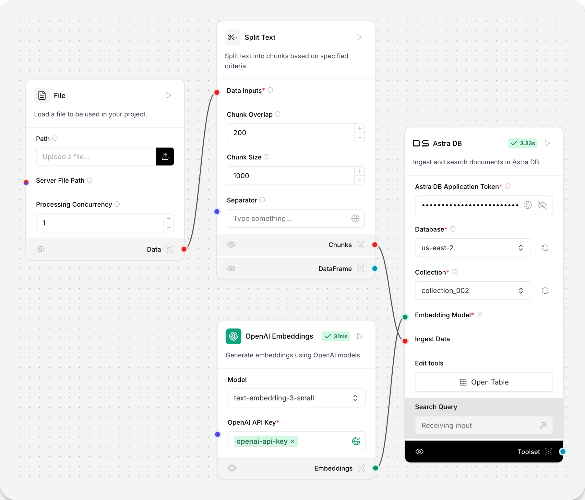

## DataFrame 

该组件用于对 DataFrame 的行和列进行操作。

在流程中使用时，将输出 DataFrame 的组件连接到 DataFrame Operations 组件。

本例中，从 API 获取 JSON 数据，Smart function 组件将结果提取并扁平化为表格 DataFrame，DataFrame Operations 组件随后可对获取的数据进行处理。

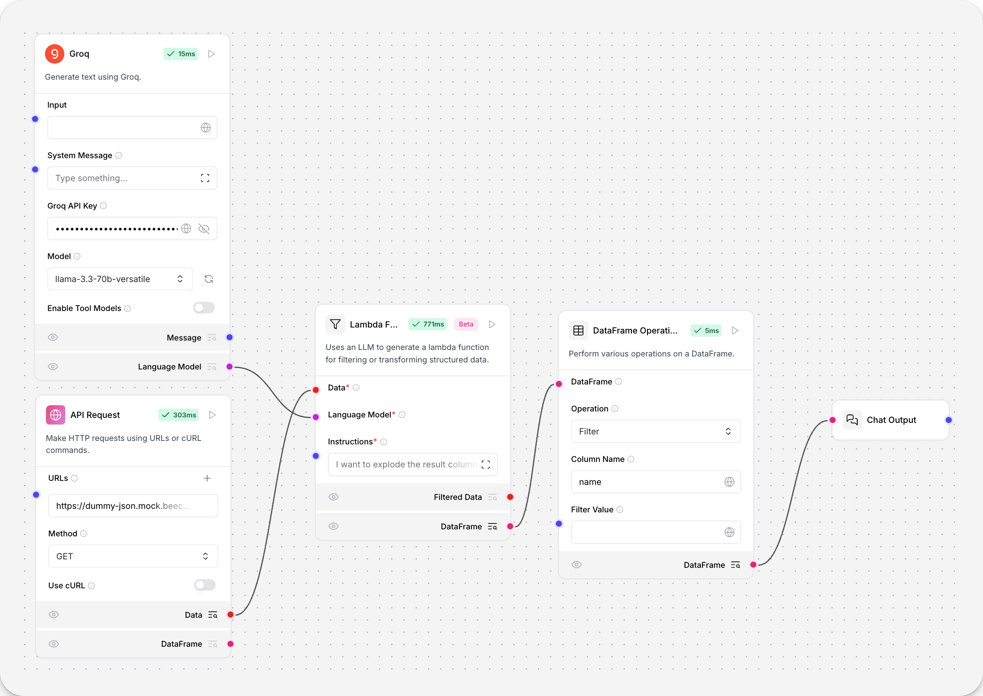

## Data 操作

该组件对 Data 对象进行操作，包括选择键、字面量求值、合并、过滤、追加/更新、移除键、重命名键等。

**用法：**  
将输出 Data 的组件连接到 Data Operations 组件。所有操作都至少需要一个 Data 输入。


## Data to DataFrame

该组件将一个或多个 Data 对象转换为 DataFrame。每个 Data 对象对应一行，.data 属性为列，.text 字段（如有）为 text 列。

**用法：**
将输出 Data 的组件连接到 Data to DataFrame 组件。
可连接 Chat Output 组件查看输出。


## LLM 路由器

该组件根据 OpenRouter 模型规范将请求路由到最合适的 LLM。

**参数**

**输入**

| 名称         | 显示名称        | 说明                               |
| ------------ | --------------- | ---------------------------------- |
| models       | Language Models | 可选的 LLM 列表                    |
| input_value  | Input           | 要路由的输入消息                   |
| judge_llm    | Judge LLM       | 用于评估和选择模型的 LLM           |
| optimization | Optimization    | 优化偏好（质量、速度、成本或平衡） |

**输出**

| 名称           | 显示名称       | 说明             |
| -------------- | -------------- | ---------------- |
| output         | Output         | 选定模型的响应   |
| selected_model | Selected Model | 被选中的模型名称 |

------

## Message 转 Data

该组件将 Message 对象转换为 Data 对象。

**参数**

**输入**

| 名称    | 显示名称 | 说明                  |
| ------- | -------- | --------------------- |
| message | Message  | 要转换的 Message 对象 |

**输出**

| 名称 | 显示名称 | 说明               |
| ---- | -------- | ------------------ |
| data | Data     | 转换后的 Data 对象 |


## 解析器（Parser）

该组件使用模板将 DataFrame 或 Data 格式化为文本，也可直接将输入转为字符串（stringify）。

**用法：**
模板变量用法同 Prompt 组件。DataFrame 用列名，如 Name: {Name}；Data 用 {text}。

**示例：**
将 Structured Output 组件的 DataFrame 输出连接到 Parser 组件的 DataFrame 输入。

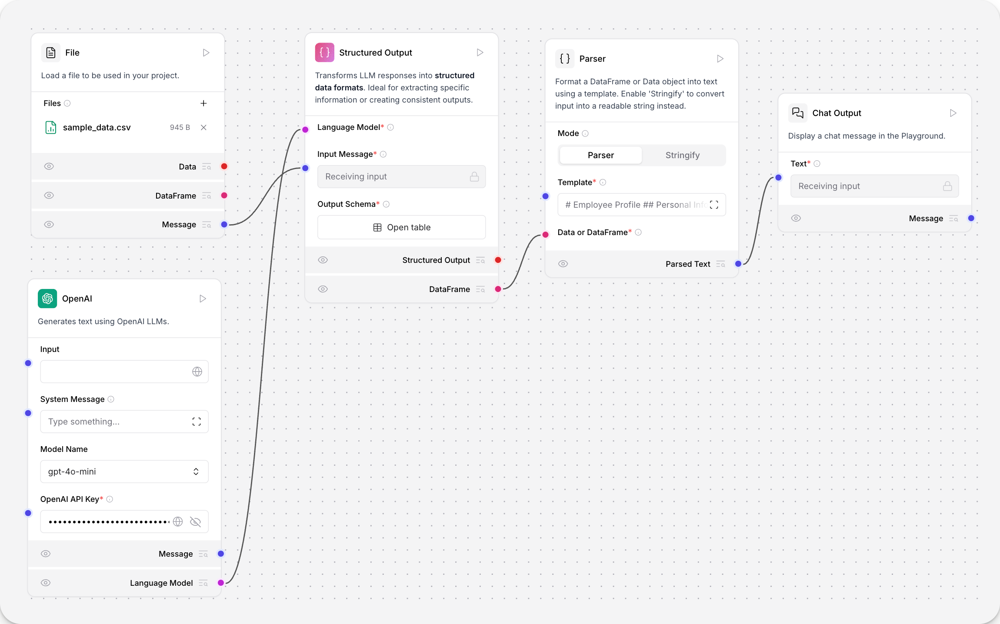模板示例：

```
# Employee Profile
## Personal Information
- **Name:** {name}
- **ID:** {id}
- **Email:** {email}

```

**参数**

**输入**

| 名称       | 显示名称          | 说明                         |
| ---------- | ----------------- | ---------------------------- |
| mode       | Mode              | "Parser" 或 "Stringify" 模式 |
| pattern    | Template          | 模板，变量用花括号           |
| input_data | Data or DataFrame | 要解析的输入                 |
| sep        | Separator         | 行/项分隔符，默认换行        |
| clean_data | Clean Data        | stringify 时清理空行         |

**输出**

| 名称        | 显示名称    | 说明                   |
| ----------- | ----------- | ---------------------- |
| parsed_text | Parsed Text | 格式化后的文本 Message |

## 正则提取器(Regex extractor)

该组件用正则表达式从文本中提取模式。

**用法：**
连接 Regex Extractor 到 URL 组件和 Chat Output 组件。
在 Regex Extractor 工具中输入正则表达式

**参数**

**输入**

| 名称       | 显示名称      | 说明               |
| ---------- | ------------- | ------------------ |
| input_text | Input Text    | 要分析的文本       |
| pattern    | Regex Pattern | 匹配用的正则表达式 |

**输出**

| 名称 | 显示名称 | 说明               |
| ---- | -------- | ------------------ |
| data | Data     | 匹配结果 Data 列表 |
| text | Message  | 匹配结果文本消息   |


## 保存到文件（Save to File）

该组件将 DataFrame、Data 或 Message 保存为多种文件格式。

**用法：**  
连接输出 DataFrame、Data 或 Message 的组件到 Save to File。  
选择输入类型和文件格式，填写文件路径。支持相对和绝对路径，自动创建目录。

**支持格式：**

- DataFrame/Data：csv、excel、json、markdown、pdf
- Message：txt、json、markdown、pdf

**参数**

**输入**

| 名称        | 显示名称    | 说明               |
| ----------- | ----------- | ------------------ |
| input_type  | Input Type  | 要保存的输入类型   |
| df          | DataFrame   | 要保存的 DataFrame |
| data        | Data        | 要保存的 Data 对象 |
| message     | Message     | 要保存的 Message   |
| file_format | File Format | 文件格式           |
| file_path   | File Path   | 完整文件路径       |

**输出**

| 名称         | 显示名称     | 说明             |
| ------------ | ------------ | ---------------- |
| confirmation | Confirmation | 保存后的确认消息 |

---

## 智能函数（Smart function）

该组件用 LLM 生成 Lambda 函数对结构化数据进行过滤或转换。

**用法：**  
连接到语言模型组件，根据 Instructions 字段的自然语言描述生成函数。

**参数**

**输入**

| 名称               | 显示名称       | 说明                        |
| ------------------ | -------------- | --------------------------- |
| data               | Data           | 要过滤或转换的结构化数据    |
| llm                | Language Model | 连接的模型组件              |
| filter_instruction | Instructions   | 过滤/转换数据的自然语言指令 |
| sample_size        | Sample Size    | 大数据集采样字符数          |
| max_size           | Max Size       | 触发采样的最大字符数        |

**输出**

| 名称          | 显示名称      | 说明               |
| ------------- | ------------- | ------------------ |
| filtered_data | Filtered Data | 过滤/转换后的 Data |
| dataframe     | DataFrame     | 过滤后的 DataFrame |

---

## 拆分文本（Split text）

该组件按指定规则将文本拆分为块，适合分块后嵌入向量数据库。

**用法：**  
连接输出 Data 或 DataFrame 的组件到 Split Text 的 Data 端口。  
设置分隔符、块大小、重叠量等参数。

**参数**

**输入**

| 名称          | 显示名称        | 说明                                 |
| ------------- | --------------- | ------------------------------------ |
| data_inputs   | Input Documents | 要拆分的数据，支持 Data 或 DataFrame |
| chunk_overlap | Chunk Overlap   | 块间重叠字符数，默认 200             |
| chunk_size    | Chunk Size      | 每块最大字符数，默认 1000            |
| separator     | Separator       | 拆分用字符，默认换行                 |
| text_key      | Text Key        | 文本列的键，默认 text                |

**输出**

| 名称      | 显示名称  | 说明                     |
| --------- | --------- | ------------------------ |
| chunks    | Chunks    | 拆分后的文本块 Data 列表 |
| dataframe | DataFrame | 拆分后的 DataFrame       |

---

## 更新数据（Update data）

该组件动态更新或追加指定字段的数据。

**参数**

**输入**

| 名称               | 显示名称           | 说明                    |
| ------------------ | ------------------ | ----------------------- |
| old_data           | Data               | 要更新的记录            |
| number_of_fields   | Number of Fields   | 要添加的字段数，最大 15 |
| text_key           | Text Key           | 文本内容的键            |
| text_key_validator | Text Key Validator | 验证文本键是否存在      |

**输出**

| 名称 | 显示名称 | 说明               |
| ---- | -------- | ------------------ |
| data | Data     | 更新后的 Data 对象 |


# Prompts

Prompt（提示词）是给语言模型的结构化输入，用于指导模型如何处理用户输入和变量。

Prompt 组件用于创建带有自定义字段和动态变量的提示模板，为你的模型提供结构化、可复用的提示。

提示词由自然语言和用花括号包裹的变量组成。

参数

**输入**

| 名称     | 显示名称 | 说明                     |
| -------- | -------- | ------------------------ |
| template | Template | 创建带动态变量的提示模板 |

**输出**

| 名称   | 显示名称       | 说明                            |
| ------ | -------------- | ------------------------------- |
| prompt | Prompt Message | build_prompt 方法返回的构建提示 |

# Tools

工具通常通过 Tools 端口连接到智能体（agent）组件。智能体使用大语言模型（LLM）作为推理引擎，决定使用哪些已连接的工具组件来解决问题。

在智能体功能中，工具本质上是智能体可以调用的函数，用于执行任务或访问外部资源。一个函数会被包装为 Tool 对象，拥有智能体能够理解的统一接口。智能体通过工具注册（tool registration）了解可用工具，通常在智能体初始化时提供工具列表。Tool 对象的描述字段告诉智能体该工具的功能。

随后，智能体会利用已连接的 LLM 进行推理，决定使用哪个工具来完成任务。


**在流程中使用工具**

工具通常通过 Tools 端口连接到智能体组件。

简单智能体入门项目（simple agent starter project）使用 URL 和 Calculator 工具连接到智能体组件，以回答用户问题。OpenAI LLM 作为智能体“大脑”，决定使用哪个工具。


要让某个组件成为智能体可用的工具，需要在该组件中启用 Tool Mode（工具模式）。启用工具模式后，组件的输入会被修改为接受来自智能体的调用。如果你想连接到智能体的组件没有 Tool Mode 选项，可以手动修改组件输入，使其成为工具。


# Vector store(向量存储组件)

向量数据库用于存储向量数据，为聊天机器人和检索增强生成（RAG）等 AI 工作负载提供支持。

向量数据库组件可以连接到已有的向量数据库，或创建内存中的向量存储，用于存储和检索向量数据。

向量数据库组件不同于 Memory 组件，后者专为从外部数据库存储和检索聊天消息而设计。

**## 在流程中使用向量存储组件**

以下示例使用 Astra DB 向量存储组件。不同的向量存储组件参数和认证方式可能不同，但文档导入流程是一样的：  

从本地加载文档并进行分块，Astra DB 向量存储组件通过已连接的模型组件生成嵌入，并将其存储到 Astra DB 数据库中。

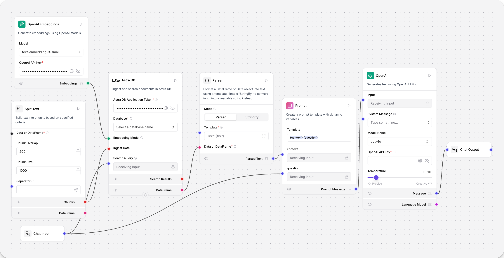

这些向量数据随后可用于检索增强生成等工作负载。

用户的聊天输入会被嵌入，并与文档导入时生成的向量进行相似度搜索。搜索结果作为 Data 对象从向量数据库组件输出，并被解析为文本。该文本填充到 Prompt 组件的 {context} 变量中，从而影响 OpenAI 模型组件的回复。

你也可以将向量数据库组件的 Retriever 端口连接到检索工具，再连接到智能体组件。这样，智能体就可以将你的向量数据库作为工具使用，并根据可用数据做出决策。

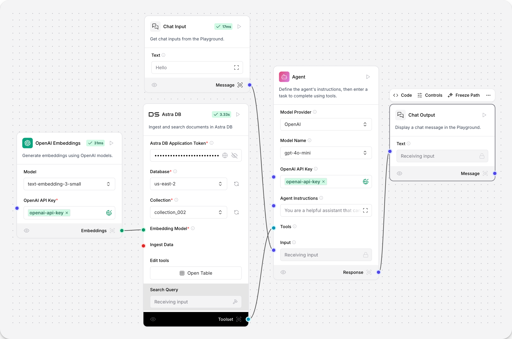

# bundles

Bundles 是由提供商分组的第三方组件。

有关捆绑组件的更多信息，请参阅组件提供商的文档。

参考：https://github.com/langflow-ai/langflow-bundles

# 创建自定义 Python 组件

## 概述

自定义组件通过继承 `Component` 的 Python 类扩展 Langflow 功能，支持集成新特性、数据处理、外部服务和专用工具。在 Langflow 的节点环境中，每个节点即“组件”，自定义组件需定义：

- **输入（Inputs）**：组件所需的数据或参数
- **输出（Outputs）**：提供给下游节点的数据
- **逻辑（Logic）**：处理输入生成输出的过程

**优势**：无限扩展性、可复用性、基于输入的自动 UI 字段生成、节点间类型安全连接。适用于专用任务、API 调用或高级逻辑添加。

---

## 组件基础结构

```python
from langflow.custom import Component
from langflow.template import Output

class MyComponent(Component):
    display_name = "组件名称"  # 节点标题显示
    description = "组件描述"   # 悬浮提示文本
    icon = "sparkles"        # 图标（Lucide 图标库）
    name = "UniqueID"        # 唯一内部标识符
    documentation = "http://docs.example.com"  # 可选文档链接

    inputs = []  # 输入列表
    outputs = [] # 输出列表

    def some_output_method(self):  # 输出方法
        return ...
```

---

## 组件生命周期

Langflow 引擎管理以下阶段：

1. **实例化**：创建组件并初始化内部结构
2. **输入赋值**：将 UI 或连接的数值分配给组件字段
3. **验证与设置**：可选钩子（如 `_pre_run_setup`）
4. **输出生成**：通过 `run()` 或 `build_results()` 触发输出方法

**可选钩子**：

- `initialize_data` 或 `_pre_run_setup`：主逻辑执行前的初始化
- `__call__`、`run()` 或 `_run()`：自定义执行逻辑

---

## 输入与输出定义

### 输入（Inputs）

通过 `langflow.io` 类定义（如 `StrInput`、`DropdownInput`）：

```python
from langflow.io import StrInput, DropdownInput

inputs = [
    StrInput(
        name="text_input",
        display_name="文本输入",
        info="提示信息",
        advanced=False,   # 是否在“高级”区域
        required=True,    # 是否必填
        is_list=False     # 是否允许多值
    ),
    DropdownInput(
        name="mode",
        display_name="模式",
        options=["快速", "安全", "实验"],
        value="安全"
    )
]
```

**常用输入类型**：

- 文本类：`StrInput`（单行）、`MultilineInput`（多行）
- 数值类：`IntInput`、`FloatInput`、`BoolInput`
- 下拉菜单：`DropdownInput`
- 敏感数据：`SecretStrInput`（API 密钥等）
- 文件上传：`FileInput`
- 句柄连接：`HandleInput`（确保类型安全）

### 输出（Outputs）

每个输出需绑定方法：

```python
outputs = [
    Output(
        display_name="处理结果",
        name="processed_data",
        method="process_data"  # 绑定方法名
    )
]

def process_data(self) -> Data:  # 返回类型建议标注
    result = {"key": "value"}
    self.status = "状态提示（UI显示）"  # 执行状态反馈
    return Data(data=result)
```

**常用返回类型**：

- `Message`：结构化聊天消息（如聊天机器人）
- `Data`：灵活对象（含 `.data` 和 `.text` 字段）
- `DataFrame`：表格数据（Pandas 兼容）
- 基础类型（如 `str`、`int`，建议封装为结构体）

---

## 高级特性

### 动态字段配置

通过 `dynamic=True` 和 `real_time_refresh=True` 实现实时 UI 更新：

```python
def update_build_config(self, build_config: dict, field_value: str, field_name: str) -> dict:
    if field_name == "operator":
        build_config["regex_pattern"]["show"] = (field_value == "regex")
    return build_config
```

**最佳实践**：

- 最小化字段变动，避免混淆
- 隐藏字段时保留数据（`"show": False`）
- 复杂逻辑拆分为子组件

### 错误处理与日志

- **异常抛出**：`raise ValueError("错误描述")`（Langflow 自动捕获并显示）
- **结构化错误返回**：`return Data(data={"error": "详情"})`（下游可处理）
- **状态提示**：`self.status = "成功解析 10 行"`
- **选择性停止输出**：`self.stop("output_name")`（不影响其他输出）
- **日志记录**：`self.log("事件详情")`（调试面板可查）

---

## 目录结构与部署

### 目录规范

```
LANGFLOW_COMPONENTS_PATH/  # 环境变量指定路径
└── category_name/         # 分类文件夹（决定 UI 菜单名）
    └── custom_component.py
```

**示例**：

```
/app/custom_components/
    ├── helpers/           # 显示在 "Helpers" 菜单
    │   └── helper_tool.py
    └── parsers/
        └── pdf_parser.py
```

**注意**：组件必须置于分类文件夹内，根目录文件不会被加载。

### 工具模式（Tool Mode）

设置 `tool_mode=True` 使组件可被 Agent 等工具调用：

```python
inputs = [
    MessageTextInput(
        name="message",
        display_name="消息",
        tool_mode=True  # 启用工具模式
    )
]
```

支持的类型：`DataInput`、`DataFrameInput`、`PromptInput` 等。

---

## 类型标注最佳实践

- **强制标注输出类型**：如 `-> Data`，启用 UI 颜色编码和连接验证
- **封装原始数据**：优先使用 `Data`/`Message` 而非裸结构
- **内部方法标注**：提升可维护性
- **一致性原则**：全流程统一类型