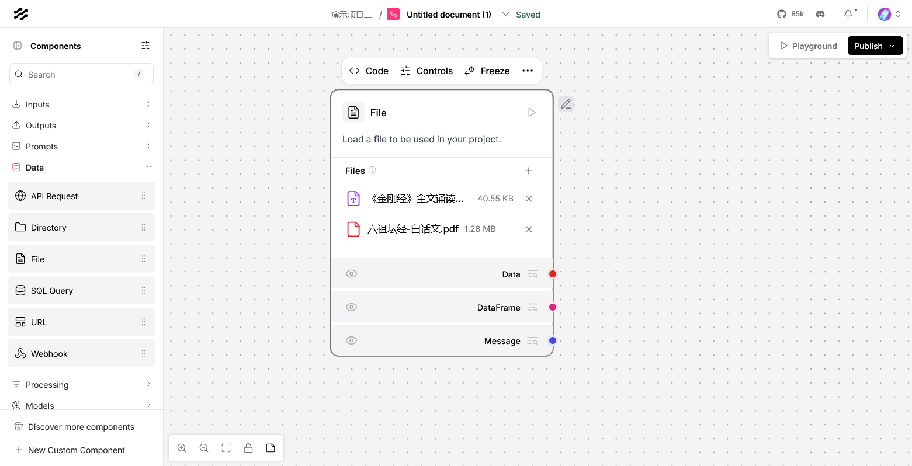
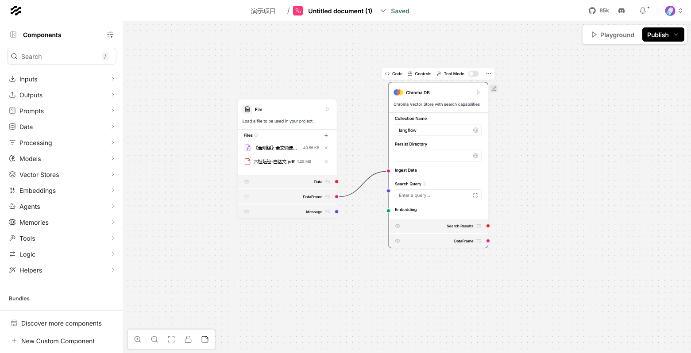
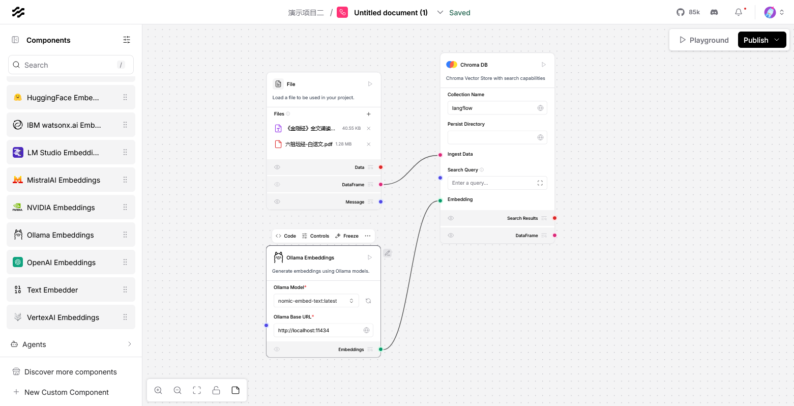
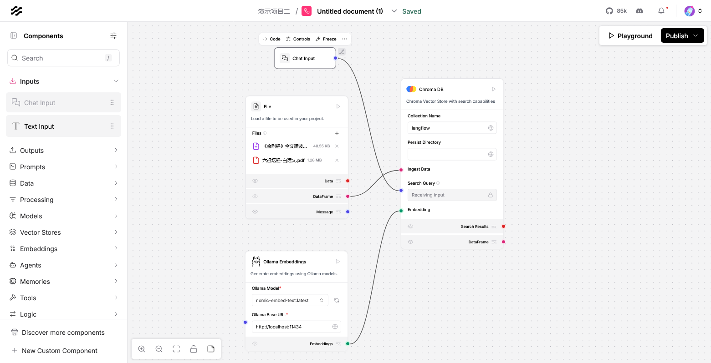
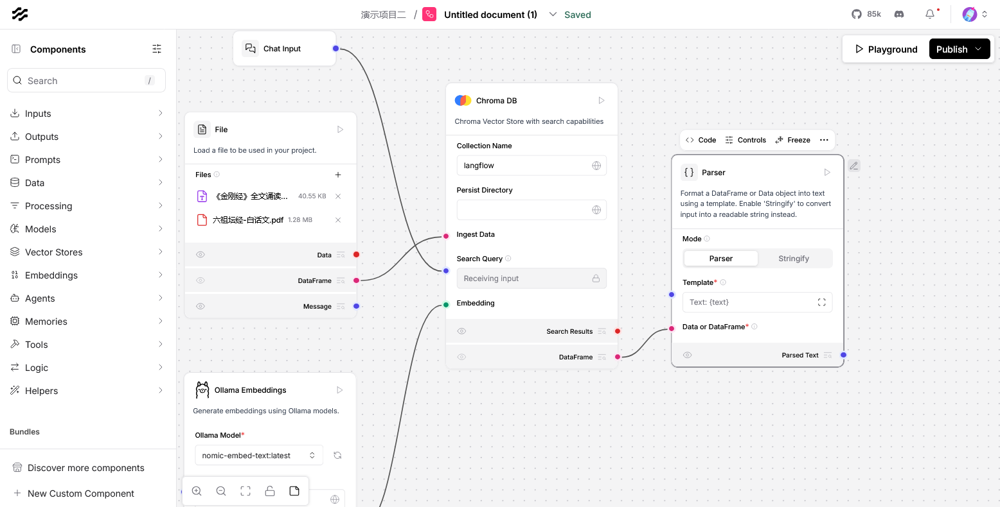
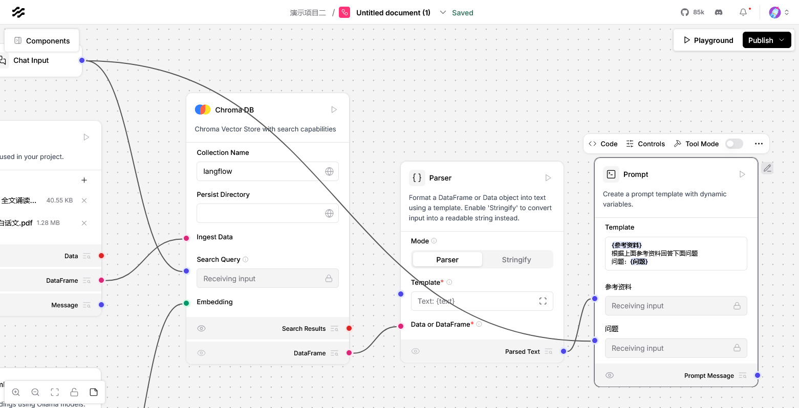
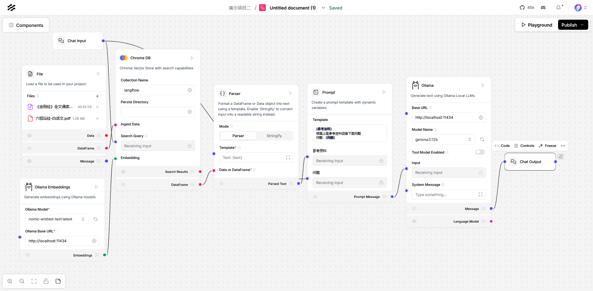
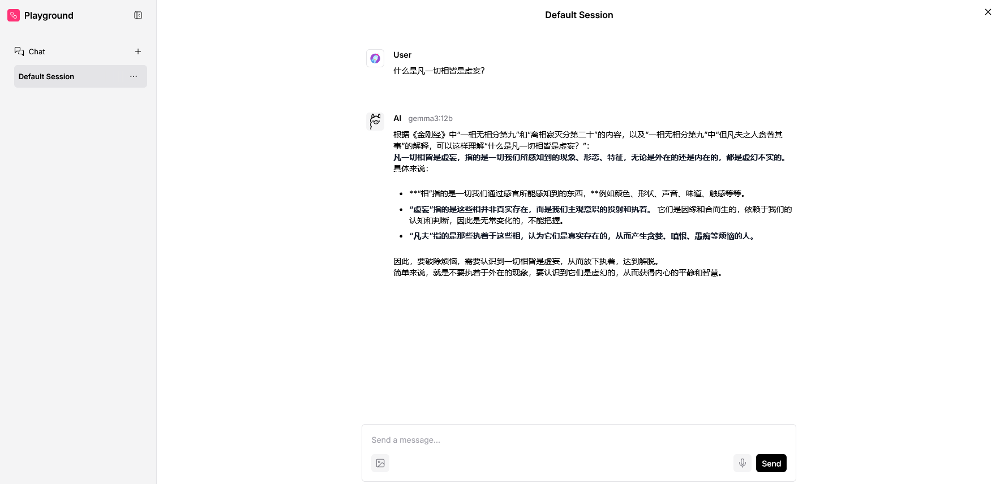

# 简介

通过LangFlow的文件、资料、向量与大模型协同工作，个人知识库的搭建门槛被大幅降低。无论是技术爱好者还是企业开发者，均可快速构建具备动态检索与生成能力的智能系统，释放知识管理的潜力。

# 文件组件

新增一个文件组件加载并解析各种格式的文件，将内容转换为 Data 对象。

这里我们以两本佛教经典为例：



# 向量数据库

向量数据库用于存储搜索向量数据，这里我们新增一个向量数据库并将我们文件的输出接入到向量数据库。

为什么要用向量数据库，大模型处理的是非结构化、高维、模糊的语义信息。向量查找通过数学抽象将语义相似性转化为可计算的几何距离，结合高效的近似搜索算法，成为支撑大模型核心能力（如理解、生成、推理）的关键基础设施。



# 使用embeddings组件

向量组件本身不具备将文件转换为向量，所以需要接入embeddings大模型来将文本转换为向量。



同时将聊天输入也接入向量数据库的搜索，最终向量数据库会根据用户问题查找出匹配的资料。



# 将匹配的资料和用户问题组合成prompt

首先将向量数据库查到的匹配资料的输出接入到parser组件。parser组件会将DataFrame转换为字符串。



新增一个prompt组件，在template里面编辑如下内容：

```
{参考资料}
根据上面参考资料回答下面问题
问题：{问题}
```

将解析出来的匹配的资料输出接入到参考资料，将用户输入接到问题上。



# 添加大模型

将集合了参考资料和用户问题的prompt接入到大模型，再将大模型输出接到chat output上展示。



# 运行

上面一个关于金刚经和六祖坛经的个人知识库就搭好了，这里我们问一个问题

