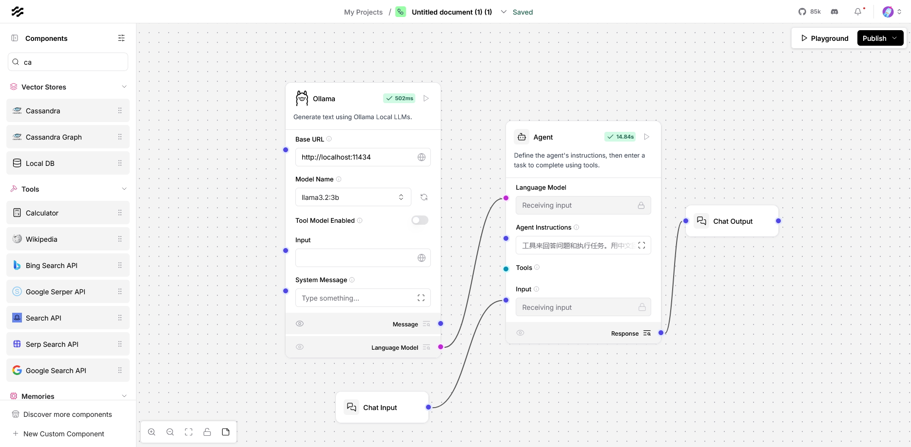
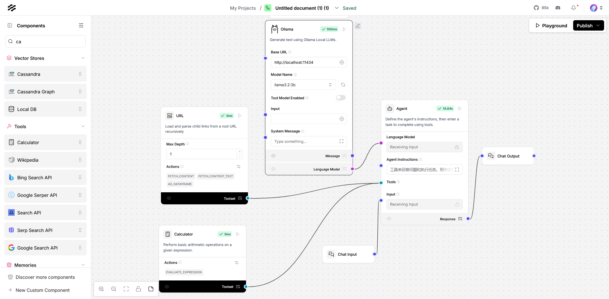
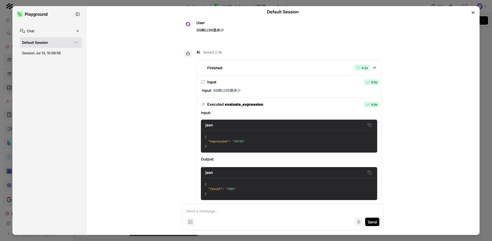
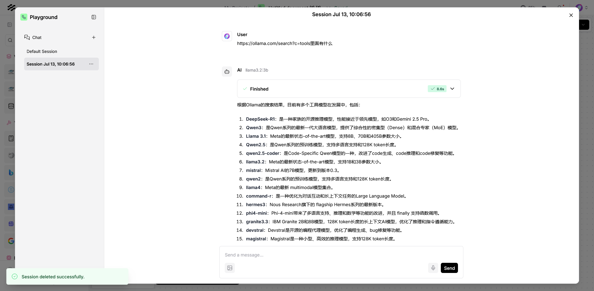

# 简介

LangFlow 是一个开源的**可视化工作流构建工具**，专为快速搭建基于大型语言模型（如GPT）的智能体（Agent）而设计。通过简单的拖拽界面，开发者无需深入编码即可创建能够**动态调用外部工具**的智能Agent。

# 搭建智能体Agent

* 选择agent组件，选择自定义选项

* 添加ollama大模型：要求支持调用tools（工具）的大模型，这里推荐qwen3或llama3.2
* 将大模型接入到agent
* 在agent两边接入输入和输出组件

# 接入工具

* 新增Url组件和Caculator组件
* 将这两个组件设为tool模式接入agent智能体

# 运行

示例一、问乘法，智能体就会自动调用Cacluator组件的**evaluate_expression**工具。

示例二、问Url，智能体就会自动调用Url组件的**fetch_content_text**工具。

