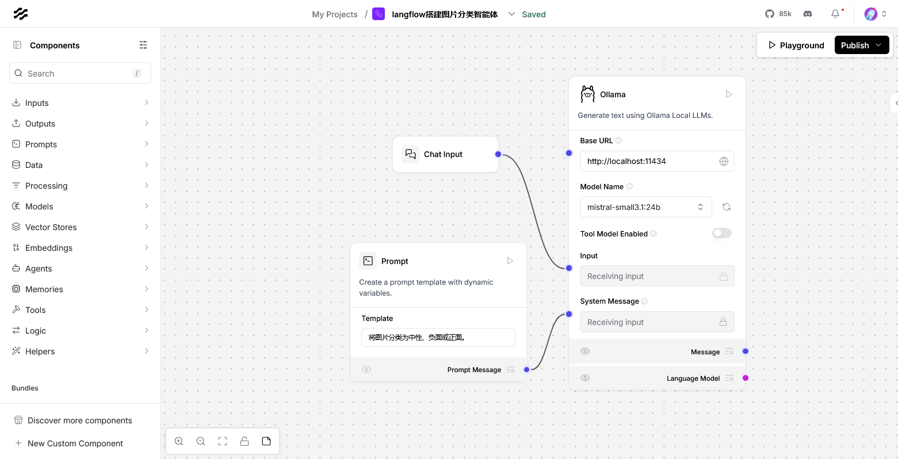
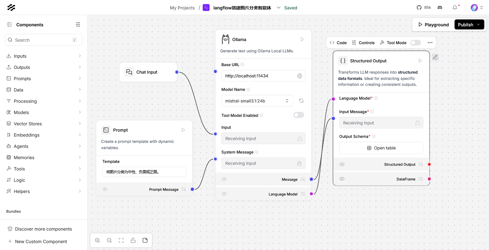
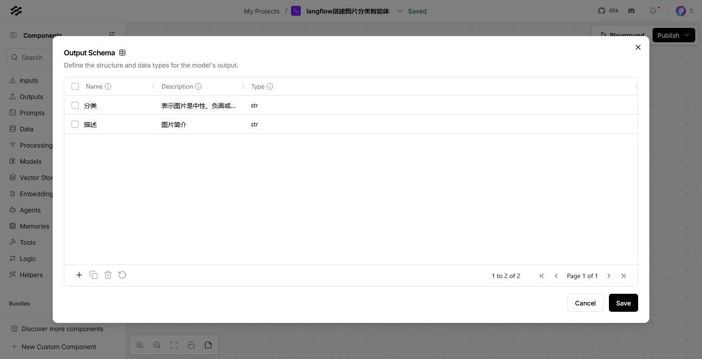
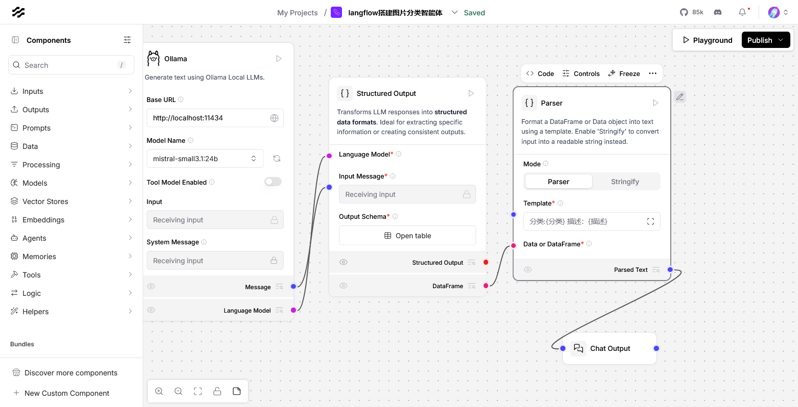
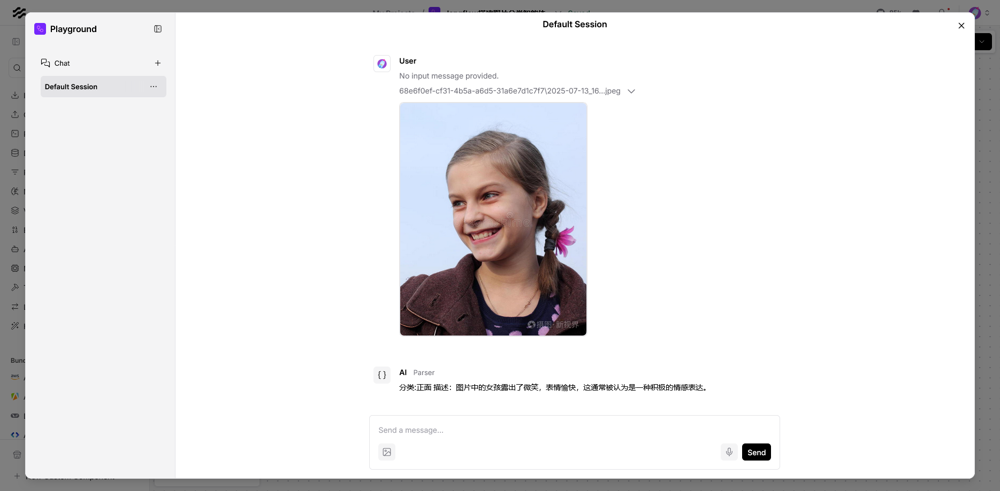
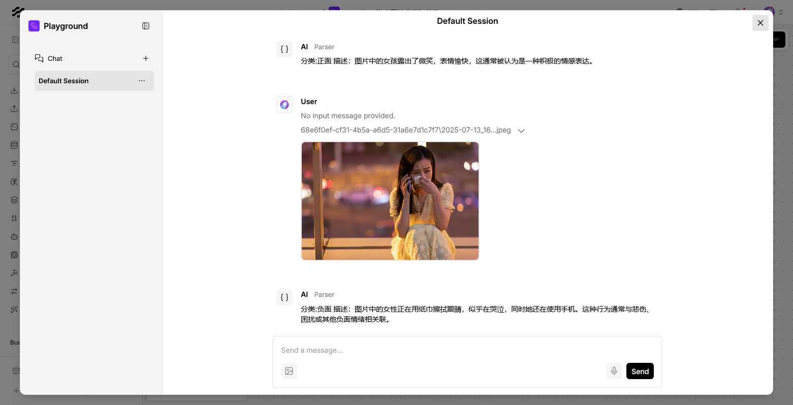

# 简介

基于LangFlow低代码平台构建的图片分类智能体，通过集成大模型，实现图像数据的自动化理解与分类。该智能体适用于电商商品归类、安防监控内容分析、医疗影像诊断辅助等场景，显著提升图像处理效率与准确性。


# 输入接入大模型

* 新增一个Chat Input用于接收用户聊天输入数据
* 新增一个Prompt指定我们的要求：将图片分类为中性，负面或正面
* 通过ollama新增一个大模型，要求支持vision(视觉)和tools(工具)




# 将大模型输出转换成结构体

新增structured output组件，该组件将 LLM 响应转换为结构化数据格式



编辑Open table指定输出的结构体，这里我们新增了分类和描述两个变量



# 按指定格式输出

* 新增parser组件，让上面结构化的数据解析为指定的格式

  ```
  分类:{分类} 描述：{描述}
  ```

* 最后将parser输出接入到聊天输出上，展示在页面。



# 运行



