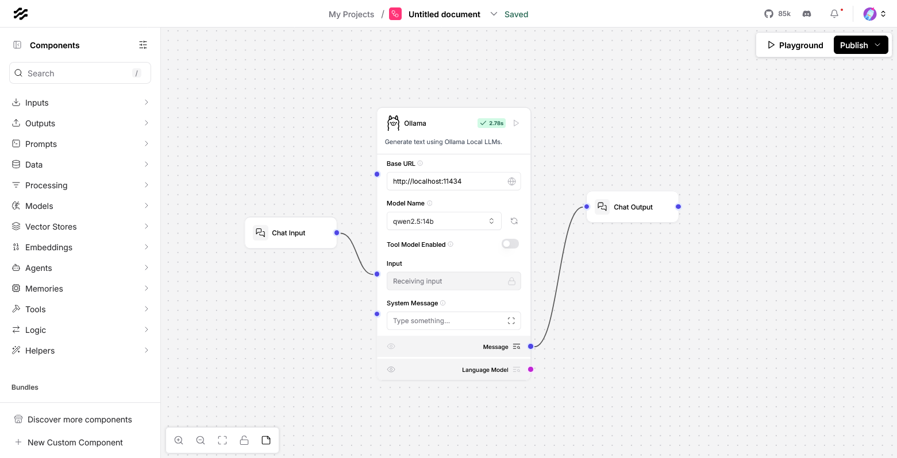
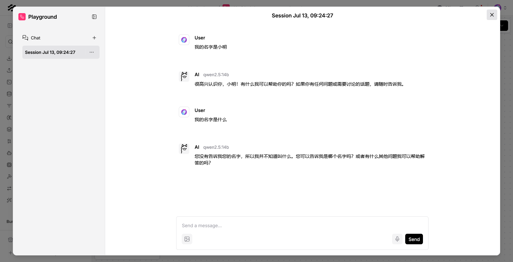
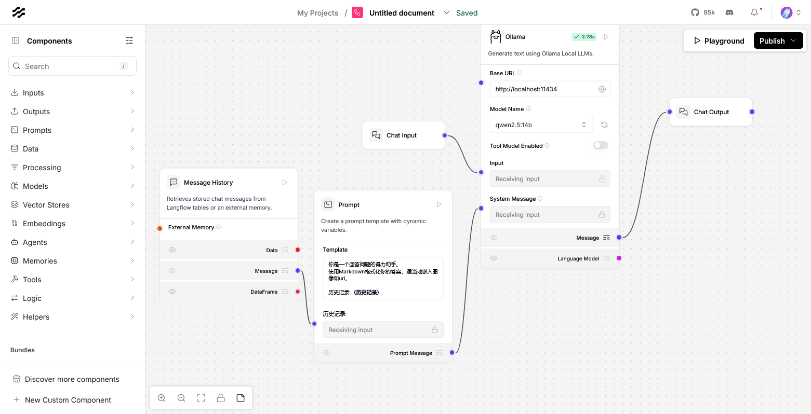
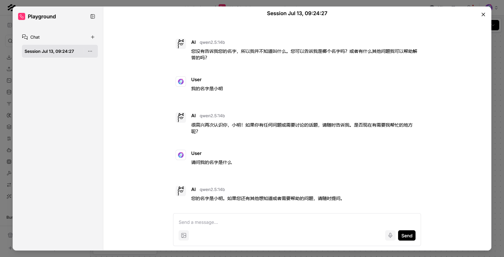

# 简介

Langflow 是一款开源的可视化 AI 应用编排工具，基于 Python 开发，支持通过拖拽组件快速构建具备记忆功能的智能聊天机器人。通过 `Message History` 组件记录历史对话，默认保留 100 条消息，支持自定义条数。也可以结合向量数据库（如 Astra DB、Chroma）存储用户偏好或关键信息，支持复杂场景下的上下文保持，这种方式可以作为**长期记忆扩展**。


# 搭建一个最简单的聊天机器人

使用输入组件+大模型组件+输出组件即可搭建一个最简单的聊天机器人



## 运行

可以看到这个聊天机器人不带记忆功能



# 加入聊天记忆功能

* 加入Message History组件：该组件用于从 Langflow 表或外部内存检索聊天消息。

* 新增prompt组件并编辑

  ```
  你是一个回答问题的得力助手。
  使用Markdown格式化你的答案，适当地嵌入图像或url。
  
  历史记录:  {历史记录}
  ```

* 将带有历史记录的prompt接入大模型即可



## 运行

可以看到大模型支持了聊天记忆功能。

