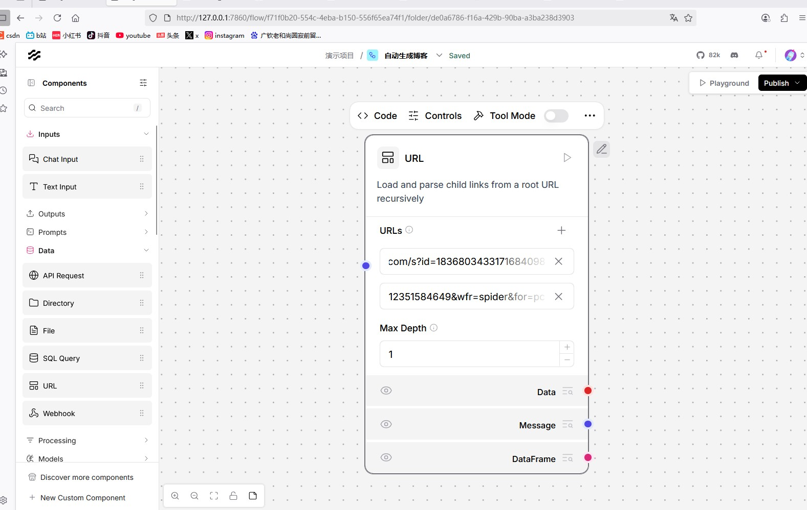
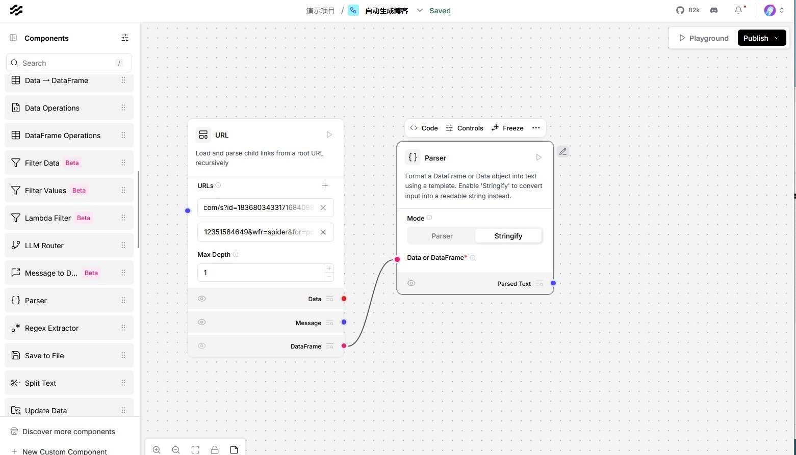
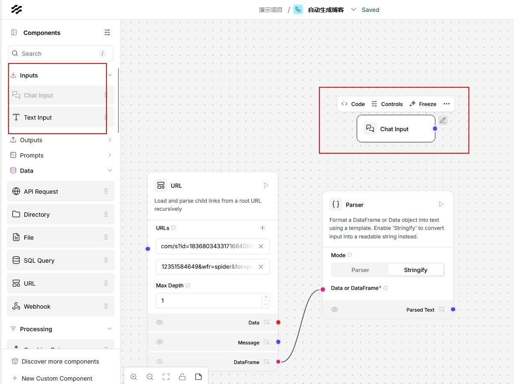
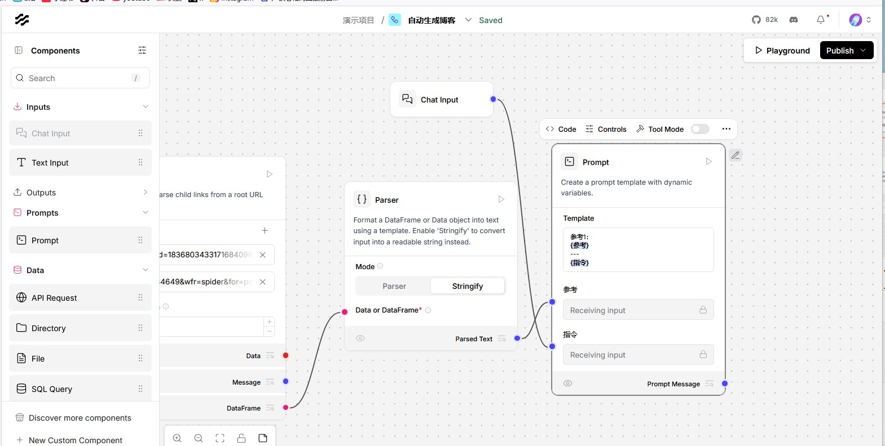
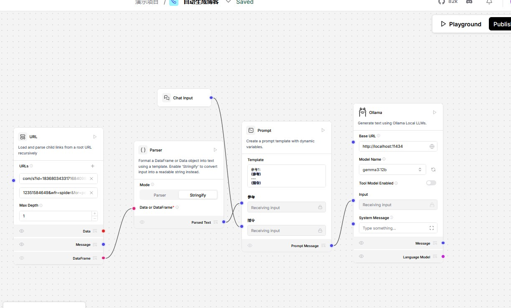
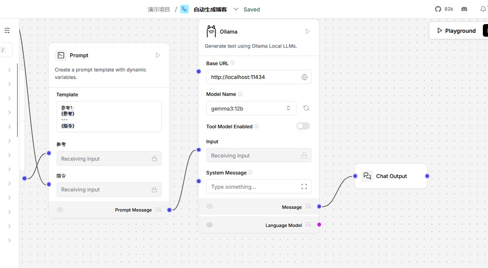
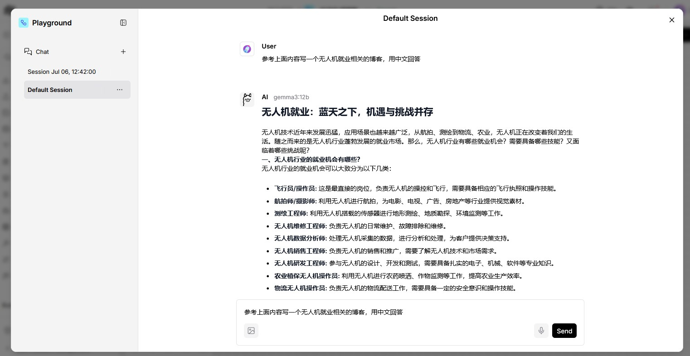

# 简介

LangFlow的核心价值在于将复杂的AI工程模块化、可视化。其基于Python的开源架构与LangChain深度集成，支持OpenAI、Deepseek、Google Gemini等主流大语言模型（LLMs），同时兼容Pinecone、Chroma等向量数据库，实现“模型无关、存储无关”的灵活部署。本文以博客场景为切入点，实现一个博客生成智能体。


# 新增参考内容

使用url组件给智能体添加一下参考内容。

url组件:抓取一个或多个 URL 的内容，处理后以多种格式返回。支持输出纯文本或原始 HTML。



在url中新增我们要参考的url

解析获取的数据，转换成字符串。

parser:该组件使用模板将 DataFrame 或 Data 格式化为文本，也可直接将输入转为字符串（stringify）。



# 新增用户输入

可以用文本框输入，也可以用聊天框输入，这里以聊天框为例

chat input:该组件从聊天中收集用户输入的文本字符串，并将其封装为包含输入文本、发送者信息、会话 ID、文件附件和样式属性的 Message 对象。

text input: Text Input 组件接受文本字符串输入，并返回仅包含输入文本的 Message 对象。



# 合成提示词（prompt）

编辑prompt

```
参考1：
{参考}
---
{指令}
```

大括号括起来的内容会自动生成变量

Prompt（提示词）:是给语言模型的结构化输入，用于指导模型如何处理用户输入和变量。



将parser的内容连到参考上，将输入连到指令上

# 新增模型

这里我们使用ollama新增一个gemma3的模型,将prompt连接到ollama的输入



# 添加输出

将ollama的message连接到输出组件上,将ollama的输出显示在聊天框



# 运行测试

点击playground运行测试

