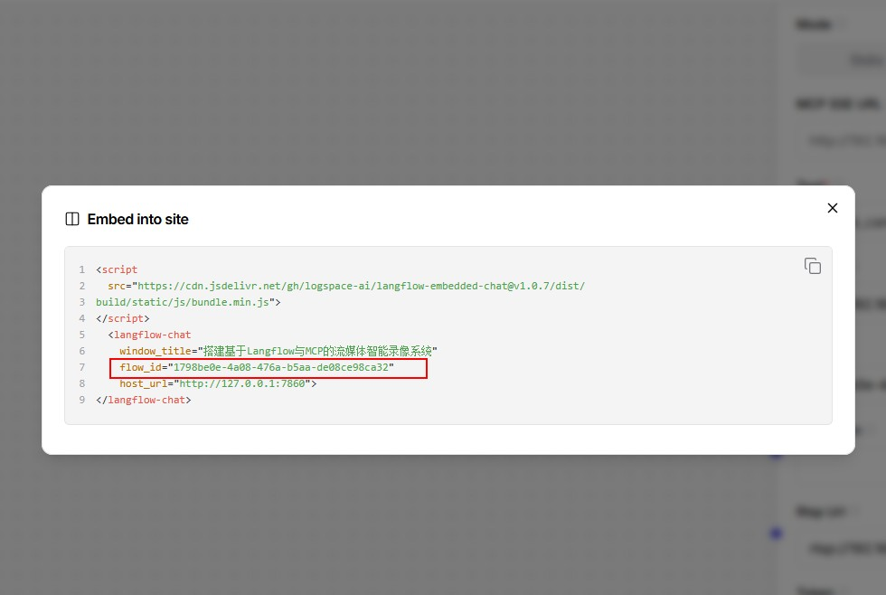
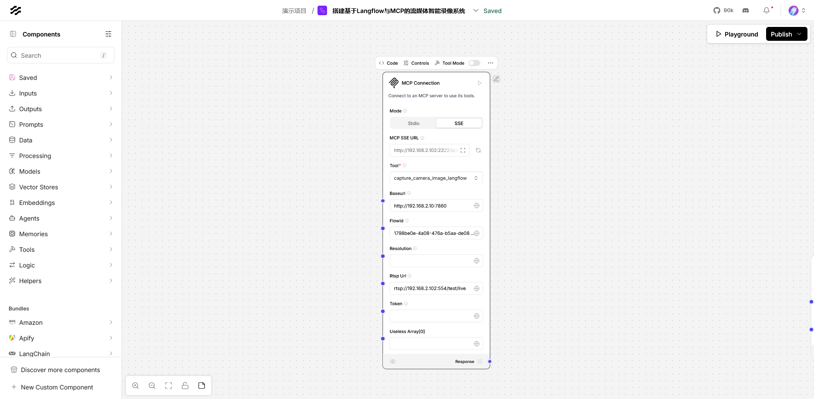
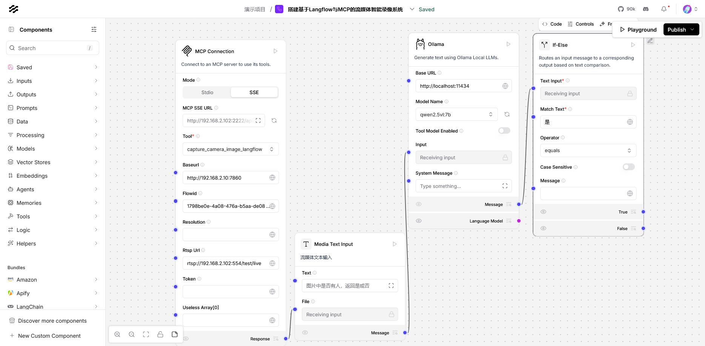
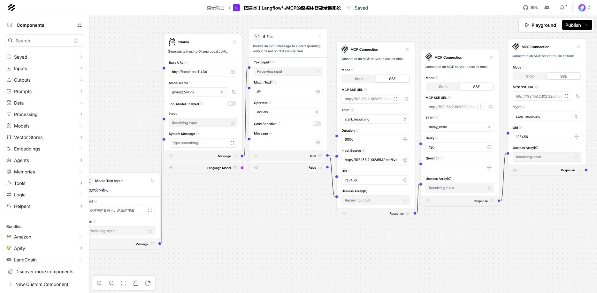
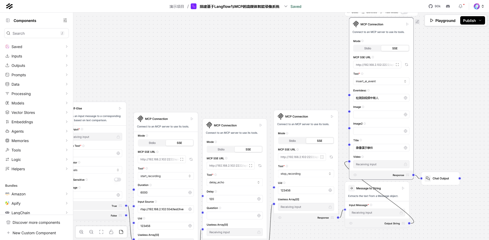
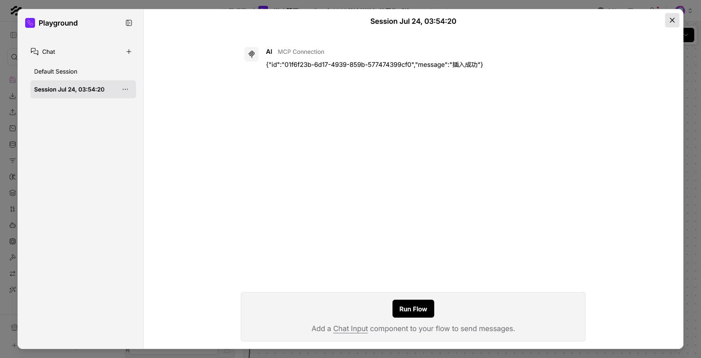
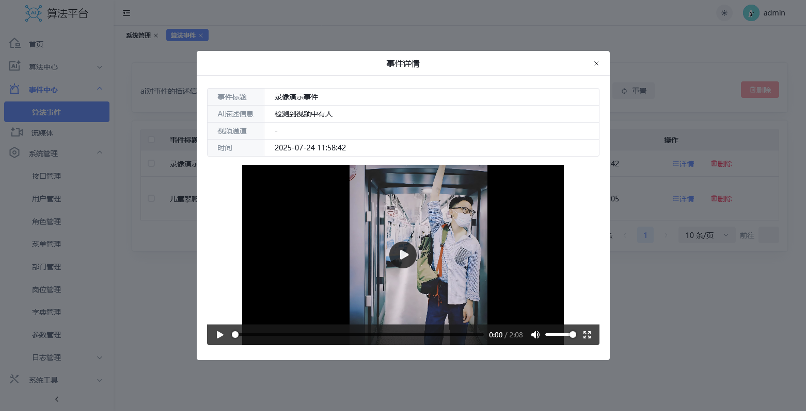
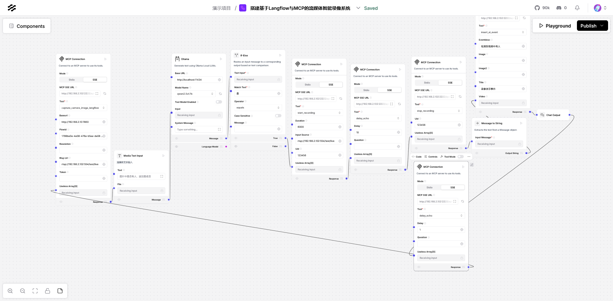

# 搭建基于Langflow与MCP的流媒体智能录像系统

本系统深度整合**Langflow可视化工作流引擎**、**MCP标准化协议**、**流媒体传输技术**及**本地化大模型**，构建了一套高精度、隐私安全的实时视频分析解决方案。通过模块化架构设计，实现视频流从采集、传输、分析到决策的全流程自动化，适用于安防监控、智能巡检、交通管理等多场景。

# 视频接入

新增一个mcp connection，用于连接智能视频分析平台的mcp服务。

* 选择sse模式，并在mcp sse url中填入智能视频分析平台的mcp服务的sse地址，这里我填写的是`http://192.168.2.102:2222/api/v1/sse`,ip地址根据自己部署的地址填写，如果langflow和智能视频分析平台部署再同一个地址可以填写`http://127.0.0.1:2222/api/v1/sse`

* 工具选择capture_camera_image_langflow,该接口会从摄像头或流媒体中获取视频图片上传到langflow中。

* baseurl填写langflow的地址和端口，这里我填写的是`http://192.168.2.10:7860`，如果langflow和智能视频分析平台部署再同一个地址可以填写`http://127.0.0.1:7860`

* Resolution是图片分辨率，如果对图片分辨率有要求可以填写，否则默认即可

* Rtsp Url： 是摄像头的rtsp地址

* Token： 如果langlfow开启了token认证则需要填写，否则不用填写

* Useless Array只用与节点连接，没有其他实际用处

* flowid在langflow每个flow的Api access或Embed into site中可以看到flow_id，可以看到这里我们的flowid是：`1798be0e-4a08-476a-b5aa-de08ce98ca32`

  

# 大模型判断

* 新增Media Text Input组件，将流媒体获取的图片接入该组件，并设定录像开始条件，这里我设定的是`图片中是否有人，返回是或否`，用于检测到画面里面有人就开始录像。
* 新增ollama组件选择本地qwen2.5vl:7b大模型。
* 新增ifelse判断组件，判断视频中是否有人。

# 录像

* 新增mcp connection并选择start_recording工具
  * 将ifelse组件的True输出连接到start_recording工具的Useless Array入口用于出发录像流程
  * Duration是录像时长，如果超过录像时长还没有调用stop_recording停止录像，系统将自动停止录像。
  * input Source： 需要录像视频流地址支持rtsp，rtmp等
  * uid：录像的唯一标识符，要求不同视频流使用不同的uid，后面停止录像需要根据uid去停止。
* 新增mcp connection并选择delay_echo工具
  * 设置延时时长120s即2分钟
  * 放在开始录像和停止录像之间来控制录像时长
* 新增mcp connection并选择stop_recording工具,停止录像，因为我们要停止的是uid为123456的录像，所以这里填写uid为123456。

# 保存

* 新增mcp connection并选择Insert_ai_event组件，进行事件的保存
  * 将停止录像的输出通过Message to String组件连接到video接口，将自动保存录像到事件中
* 加一个chat output组件打印保存结果

# 结果

运行结果如下

# 循环

如果我们希望执行完一个完整周期后，循环执行，可以新增一个mcp connection并选择工具delay_echo。

- 将chatoutput的response连接到capture_camera_image_langflow的Useless Array形成闭环。
- 如果需要中间加一个间隔可以在delay里面输入间隔的秒数。

# 项目地址

码云: https://gitee.com/daimaxiuligong/langflow

github: https://github.com/daimaxiuligong/langflow
